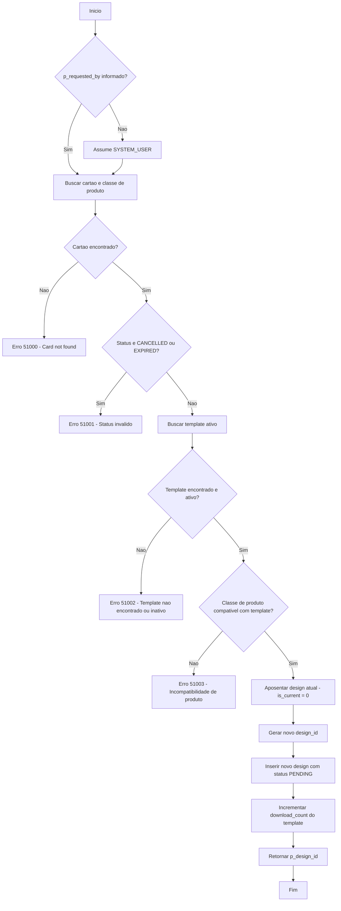

# design.sp_assign_card_design

## Descrição Geral

Procedimento pertencente à aplicação **NovoCard** responsável por atribuir ou substituir o design visual de um cartão existente. O processo envolve validação de compatibilidade entre o template escolhido e a classe de produto do cartão, aposentadoria do design anterior e criação de um novo registro de design no estado **PENDING** (pendente de aprovação). A reimpressão física do cartão é disparada por um processo externo assim que o status de aprovação atinge **APPROVED**.

---

## Parâmetros

| Parâmetro | Tipo | Obrigatório | Direção | Descrição |
|---|---|---|---|---|
| `@p_card_id` | UNIQUEIDENTIFIER | Sim | Entrada | Identificador do cartão alvo |
| `@p_template_id` | UNIQUEIDENTIFIER | Sim | Entrada | Identificador do novo template a ser aplicado |
| `@p_custom_name_text` | NVARCHAR(26) | Não | Entrada | Texto personalizado para o nome exibido no cartão |
| `@p_custom_color` | NCHAR(7) | Não | Entrada | Cor personalizada em formato hexadecimal (ex: `#FF00AA`) |
| `@p_monogram` | NCHAR(2) | Não | Entrada | Monograma de 1 ou 2 caracteres |
| `@p_requested_by` | NVARCHAR(100) | Não | Entrada | Identificação do cliente ou operador solicitante (assume `SYSTEM_USER` se não informado) |
| `@p_design_id` | UNIQUEIDENTIFIER | — | Saída | Retorna o identificador do novo registro de design criado |

---

## Tabelas Envolvidas

| Schema.Tabela | Operação | Finalidade |
|---|---|---|
| `card.cards` | SELECT | Obter status do cartão e seu tipo |
| `card.card_types` | SELECT | Obter a classe de produto (`product_class`) associada ao cartão |
| `design.design_templates` | SELECT / UPDATE | Validar template ativo, verificar compatibilidade e incrementar contador de uso |
| `design.card_designs` | UPDATE / INSERT | Aposentar design anterior e inserir o novo design |

---

## Regras de Negócio e Validações

### 1. Existência do Cartão
O cartão informado deve existir na base. Caso contrário, o erro **51000** é lançado.

### 2. Status do Cartão
Cartões com status **CANCELLED** ou **EXPIRED** não podem receber novos designs. Erro **51001** é lançado nessas situações.

### 3. Template Ativo
O template informado deve existir e estar ativo (`is_active = 1`). Caso contrário, o erro **51002** é lançado.

### 4. Compatibilidade de Classe de Produto
O campo `compatible_product_classes` do template armazena um array JSON com as classes de produto suportadas. A classe de produto do cartão deve constar nesse array. Caso contrário, o erro **51003** é lançado.

### Tabela de Erros

| Código | Mensagem | Causa |
|---|---|---|
| 51000 | Card not found. | Cartão não localizado |
| 51001 | Cannot assign design to card with status {status} | Cartão cancelado ou expirado |
| 51002 | Template not found or is inactive. | Template inexistente ou desativado |
| 51003 | Template is not compatible with product class {class} | Incompatibilidade entre template e produto |

---

## Comportamento Principal

1. **Aposentadoria do design atual** — O design vigente (`is_current = 1`) do cartão é marcado como não-corrente (`is_current = 0`) e recebe o timestamp de substituição.
2. **Criação do novo design** — Um novo registro é inserido com `is_current = 1` e `approval_status = PENDING`.
3. **Contagem de uso do template** — O campo `download_count` do template é incrementado em 1 e a data de atualização é registrada.

---

## Process Flow

---

## Insights

- O fluxo de aprovação é **assíncrono**: o procedimento apenas cria o design em estado **PENDING**, delegando a aprovação e a consequente reimpressão física a processos externos.
- A compatibilidade entre template e produto é controlada via **array JSON** no campo `compatible_product_classes`, o que permite flexibilidade na configuração sem alteração de schema.
- Não há controle transacional explícito (`BEGIN TRANSACTION` / `COMMIT`) dentro do procedimento. Caso a atomicidade entre a aposentadoria do design anterior e a inserção do novo seja crítica, o chamador deve encapsular a execução em uma transação.
- O campo `@p_requested_by` funciona como trilha de auditoria, porém é inserido apenas implicitamente (não aparece na cláusula `INSERT`), sugerindo que a tabela `card_designs` pode possuir um valor default ou trigger que capture essa informação — ou que o campo deveria ser incluído na inserção.
- O incremento de `download_count` no template serve como métrica de popularidade/uso, podendo alimentar dashboards de análise de preferência de design pelos clientes.
- Apenas **um design ativo** por cartão é permitido por vez, garantido pela lógica de aposentadoria antes da inserção.
