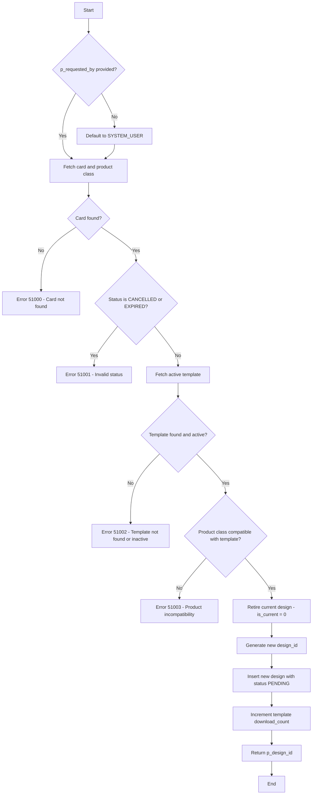

# design.sp_assign_card_design

## General Description

Procedure belonging to the **NovoCard** application responsible for assigning or replacing the visual design of an existing card. The process involves validating compatibility between the chosen template and the card's product class, retiring the previous design, and creating a new design record in **PENDING** status (awaiting approval). Physical card reprinting is triggered by an external process once the approval status reaches **APPROVED**.

---

## Parameters

| Parameter | Type | Required | Direction | Description |
|---|---|---|---|---|
| `@p_card_id` | UNIQUEIDENTIFIER | Yes | Input | Target card identifier |
| `@p_template_id` | UNIQUEIDENTIFIER | Yes | Input | Identifier of the new template to be applied |
| `@p_custom_name_text` | NVARCHAR(26) | No | Input | Custom text for the name displayed on the card |
| `@p_custom_color` | NCHAR(7) | No | Input | Custom color in hexadecimal format (e.g., `#FF00AA`) |
| `@p_monogram` | NCHAR(2) | No | Input | Monogram of 1 or 2 characters |
| `@p_requested_by` | NVARCHAR(100) | No | Input | Customer or operator identifier (defaults to `SYSTEM_USER` if not provided) |
| `@p_design_id` | UNIQUEIDENTIFIER | — | Output | Returns the identifier of the newly created design record |

---

## Tables Involved

| Schema.Table | Operation | Purpose |
|---|---|---|
| `card.cards` | SELECT | Get card status and its type |
| `card.card_types` | SELECT | Get the product class (`product_class`) associated with the card |
| `design.design_templates` | SELECT / UPDATE | Validate active template, check compatibility, and increment usage counter |
| `design.card_designs` | UPDATE / INSERT | Retire the previous design and insert the new design |

---

## Business Rules and Validations

### 1. Card Existence
The provided card must exist in the database. Otherwise, error **51000** is thrown.

### 2. Card Status
Cards with **CANCELLED** or **EXPIRED** status cannot receive new designs. Error **51001** is thrown in these situations.

### 3. Active Template
The provided template must exist and be active (`is_active = 1`). Otherwise, error **51002** is thrown.

### 4. Product Class Compatibility
The template's `compatible_product_classes` field stores a JSON array with the supported product classes. The card's product class must be present in this array. Otherwise, error **51003** is thrown.

### Error Table

| Code | Message | Cause |
|---|---|---|
| 51000 | Card not found. | Card not found |
| 51001 | Cannot assign design to card with status {status} | Card is cancelled or expired |
| 51002 | Template not found or is inactive. | Template does not exist or is deactivated |
| 51003 | Template is not compatible with product class {class} | Incompatibility between template and product |

---

## Main Behavior

1. **Retiring the current design** — The active design (`is_current = 1`) of the card is marked as non-current (`is_current = 0`) and receives the replacement timestamp.
2. **Creating the new design** — A new record is inserted with `is_current = 1` and `approval_status = PENDING`.
3. **Template usage count** — The template's `download_count` field is incremented by 1 and the update timestamp is recorded.

---

## Process Flow

---

## Insights

- The approval workflow is **asynchronous**: the procedure only creates the design in **PENDING** state, delegating approval and the subsequent physical reprinting to external processes.
- Compatibility between template and product is controlled via a **JSON array** in the `compatible_product_classes` field, allowing flexible configuration without schema changes.
- There is no explicit transactional control (`BEGIN TRANSACTION` / `COMMIT`) within the procedure. If atomicity between retiring the previous design and inserting the new one is critical, the caller must wrap the execution in a transaction.
- The `@p_requested_by` field serves as an audit trail, but is only inserted implicitly (not appearing in the `INSERT` clause), suggesting that the `card_designs` table may have a default value or trigger that captures this information — or that the field should be included in the insert.
- The increment of `download_count` on the template serves as a popularity/usage metric, which can feed dashboards analyzing customer design preference.
- Only **one active design** per card is permitted at a time, guaranteed by the retirement logic before insertion.
