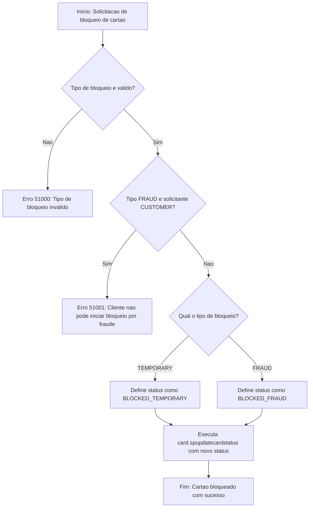

# card.spblockcard

## Descrição

Procedimento responsável por realizar o bloqueio de um cartão no sistema NovoCard. Atua como uma camada de conveniência sobre o procedimento `card.spupdatecardstatus`, encapsulando as regras de negócio específicas para operações de bloqueio.

O procedimento suporta dois cenários distintos de bloqueio:

| Tipo de Bloqueio | Descrição | Reversível |
|---|---|---|
| **TEMPORARY** | Bloqueio temporário iniciado pelo cliente (ex.: via aplicativo) | Sim |
| **FRAUD** | Bloqueio por fraude, acionado por analista de risco ou motor antifraude | Não (requer revisão manual de analista) |

## Parâmetros

| Parâmetro | Tipo | Padrão | Descrição |
|---|---|---|---|
| `@pcardid` | UNIQUEIDENTIFIER | — | Identificador único do cartão a ser bloqueado |
| `@pblocktype` | NVARCHAR(20) | `TEMPORARY` | Tipo de bloqueio: `TEMPORARY` ou `FRAUD` |
| `@preason` | NVARCHAR(255) | NULL | Motivo do bloqueio em texto livre |
| `@pinitiatedby` | NVARCHAR(20) | `CUSTOMER` | Origem da solicitação: `CUSTOMER`, `RISKANALYST`, `FRAUDENGINE` ou `SUPPORT` |
| `@poperatorid` | NVARCHAR(100) | NULL | Identificação do colaborador (obrigatório quando o solicitante não é o cliente) |
| `@pchannel` | NVARCHAR(20) | `APP` | Canal pelo qual a solicitação foi realizada |

## Regras de Negócio

1. **Validação do tipo de bloqueio** — Apenas os valores `TEMPORARY` e `FRAUD` são aceitos. Qualquer outro valor resulta em erro.

2. **Restrição de bloqueio por fraude para clientes** — Um cliente não pode iniciar um bloqueio do tipo `FRAUD`. Caso tente, o sistema rejeita a operação e orienta o uso do tipo `TEMPORARY`.

3. **Mapeamento de status** — O tipo de bloqueio é traduzido para o status correspondente do cartão:

   | Tipo de Bloqueio | Status Resultante |
   |---|---|
   | TEMPORARY | BLOCKED_TEMPORARY |
   | FRAUD | BLOCKED_FRAUD |

4. A atualização efetiva do status é delegada ao procedimento `card.spupdatecardstatus`.

## Process Flow

## Tratamento de Erros

| Código | Mensagem | Cenário |
|---|---|---|
| 51000 | Invalid block type. Must be TEMPORARY or FRAUD. | Tipo de bloqueio informado não é reconhecido |
| 51001 | Customers cannot initiate FRAUD blocks. Use TEMPORARY instead. | Cliente tentou solicitar bloqueio do tipo FRAUD |

## Insights

- O procedimento utiliza valores padrão que favorecem o cenário mais comum: bloqueio temporário iniciado pelo cliente via aplicativo. Isso simplifica a integração para os canais digitais de autoatendimento.
- A separação entre bloqueio temporário e por fraude permite trilhas de auditoria distintas e fluxos de reversão diferenciados, o que é essencial para conformidade regulatória.
- O parâmetro `@poperatorid` viabiliza a rastreabilidade de ações realizadas por colaboradores internos (analistas de risco, suporte), sendo relevante para auditorias e investigações.
- A delegação da atualização efetiva ao `card.spupdatecardstatus` sugere que esse procedimento centraliza lógica compartilhada como registro de histórico, validação de estado atual do cartão e notificações, evitando duplicação.
