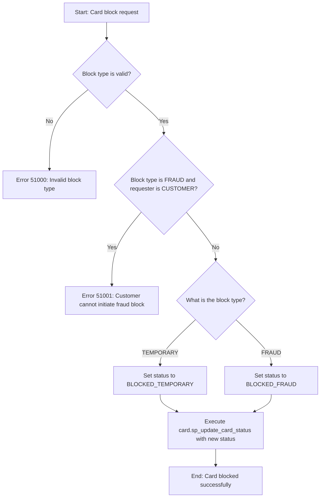

# card.sp_block_card

## Description

Procedure responsible for blocking a card in the NovoCard system. Acts as a convenience layer over the `card.sp_update_card_status` procedure, encapsulating the specific business rules for blocking operations.

The procedure supports two distinct blocking scenarios:

| Block Type | Description | Reversible |
|---|---|---|
| **TEMPORARY** | Temporary block initiated by the customer (e.g., via mobile app) | Yes |
| **FRAUD** | Fraud block triggered by a risk analyst or fraud engine | No (requires manual analyst review) |

## Parameters

| Parameter | Type | Default | Description |
|---|---|---|---|
| `@p_card_id` | UNIQUEIDENTIFIER | — | Unique identifier of the card to be blocked |
| `@p_block_type` | NVARCHAR(20) | `TEMPORARY` | Block type: `TEMPORARY` or `FRAUD` |
| `@p_reason` | NVARCHAR(255) | NULL | Block reason in free text |
| `@p_initiated_by` | NVARCHAR(20) | `CUSTOMER` | Request origin: `CUSTOMER`, `RISKANALYST`, `FRAUDENGINE`, or `SUPPORT` |
| `@p_operator_id` | NVARCHAR(100) | NULL | Staff member identification (required when the requester is not the customer) |
| `@p_channel` | NVARCHAR(20) | `APP` | Channel through which the request was made |

## Business Rules

1. **Block type validation** — Only `TEMPORARY` and `FRAUD` values are accepted. Any other value results in an error.

2. **Fraud block restriction for customers** — A customer cannot initiate a `FRAUD` block. If attempted, the system rejects the operation and recommends using `TEMPORARY` instead.

3. **Status mapping** — The block type is translated to the corresponding card status:

   | Block Type | Resulting Status |
   |---|---|
   | TEMPORARY | BLOCKED_TEMPORARY |
   | FRAUD | BLOCKED_FRAUD |

4. The actual status update is delegated to the `card.sp_update_card_status` procedure.

## Process Flow

## Error Handling

| Code | Message | Scenario |
|---|---|---|
| 51000 | Invalid block type. Must be TEMPORARY or FRAUD. | The provided block type is not recognized |
| 51001 | Customers cannot initiate FRAUD blocks. Use TEMPORARY instead. | Customer attempted to request a FRAUD block |

## Insights

- The procedure uses default values that favor the most common scenario: a temporary block initiated by the customer via mobile app. This simplifies integration for digital self-service channels.
- The separation between temporary and fraud blocks enables distinct audit trails and differentiated reversal workflows, which is essential for regulatory compliance.
- The `@p_operator_id` parameter enables traceability of actions taken by internal staff (risk analysts, support), which is relevant for audits and investigations.
- Delegating the actual update to `card.sp_update_card_status` suggests that this procedure centralizes shared logic such as history recording, current card state validation, and notifications, avoiding duplication.
