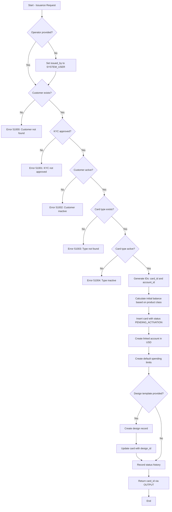

# Documentation: Card Issuance Procedure

## Overview

| Attribute | Detail |
|---|---|
| **Name** | `card.sp_issue_card` |
| **Application** | NovoCard |
| **Schema** | `card` |
| **Purpose** | Issue a new card for an eligible customer, performing all required business validations and creating associated records in a single atomic transaction |

The procedure orchestrates the complete card issuance process, from customer eligibility verification through card creation, its linked account, default spending limits, and optionally, the assignment of a visual design template.

---

## Parameters

| Parameter | Type | Required | Default | Description |
|---|---|---|---|---|
| `@p_customer_id` | UNIQUEIDENTIFIER | Yes | — | Identifier of the target customer |
| `@p_card_type_id` | INT | Yes | — | Card product type to be issued |
| `@p_cardholder_name` | NVARCHAR(100) | Yes | — | Name to be embossed/printed on the card |
| `@p_masked_pan` | NVARCHAR(19) | Yes | — | Masked PAN pre-generated by the vault service |
| `@p_expiry_month` | SMALLINT | Yes | — | Expiry month (1–12) |
| `@p_expiry_year` | SMALLINT | Yes | — | Expiry year (4 digits) |
| `@p_card_format` | NVARCHAR(10) | No | `PHYSICAL` | Card format: `PHYSICAL`, `VIRTUAL`, or `BOTH` |
| `@p_template_id` | UNIQUEIDENTIFIER | No | NULL | Visual design template (optional) |
| `@p_credit_limit` | DECIMAL(15,2) | No | 0.00 | Initial credit limit (0 for debit/prepaid) |
| `@p_initial_balance` | DECIMAL(15,2) | No | 0.00 | Initial loaded balance (applicable to prepaid only) |
| `@p_issued_by` | NVARCHAR(100) | No | `SYSTEM_USER` | Identifier of the requesting operator or system |
| `@p_card_id` | UNIQUEIDENTIFIER | **OUTPUT** | — | Returns the identifier of the newly created card |

---

## Business Rules

### Eligibility Validations

| # | Rule | Error Code | Message |
|---|---|---|---|
| 1 | The customer must exist in the database | 51000 | *Customer not found.* |
| 2 | The customer's KYC status must be **APPROVED** | 51001 | *Customer KYC status is [status]. Card issuance requires APPROVED status.* |
| 3 | The customer must have **ACTIVE** status | 51002 | *Customer is not ACTIVE (current: [status]). Cannot issue card.* |
| 4 | The requested card type must exist | 51003 | *Card type not found.* |
| 5 | The card type must be active (`is_active = 1`) | 51004 | *Card type is not currently active.* |

### Processing Rules

- The initial balance (`initial_balance`) is only applied when the product class is **PREPAID**. For other classes, the balance is automatically set to zero.
- Every card is created with an initial status of **PENDING_ACTIVATION**, requiring subsequent activation.
- The default account currency is **USD**.
- Default spending limits are automatically created by the system (`set_by = SYSTEM`).
- When a design template is provided, it is linked to the card with approval status **APPROVED** and marked as the current design (`is_current = 1`).
- If the `@p_issued_by` parameter is not provided, the system uses the SQL Server `SYSTEM_USER` function to identify the operator.

---

## Entities Involved

| Table | Schema | Operation | Purpose |
|---|---|---|---|
| `customer.customers` | customer | SELECT | Validates customer existence, KYC, and status |
| `card.card_types` | card | SELECT | Validates the card type |
| `card.cards` | card | INSERT / UPDATE | Creates the main card record |
| `card.card_accounts` | card | INSERT | Creates the financial account linked to the card |
| `card.card_limits` | card | INSERT | Sets the default spending limits |
| `card.card_status_history` | card | INSERT | Records status history (audit) |
| `design.card_designs` | design | INSERT | Assigns the visual design template |

---

## Process Flow

---

## Insights

- **Controlled concurrency**: The customer query uses lock hints (`UPDLOCK, ROWLOCK`), preventing race conditions in simultaneous issuance scenarios for the same customer.
- **Implicit atomicity**: Although the procedure does not explicitly declare `BEGIN TRANSACTION`, the expectation is that the caller manages the external transaction, ensuring all records (card, account, limits, design, history) are persisted or rolled back together.
- **Complete traceability**: Status history is recorded from creation, with previous status `N/A` and new status `PENDING_ACTIVATION`, enabling complete lifecycle auditing of the card.
- **Vault responsibility separation**: The PAN (card number) is neither generated nor stored in clear text by this procedure — only the masked version is received from an external vault service, reinforcing compliance with security standards such as **PCI-DSS**.
- **Initial balance conditional on product class**: The logic ensures that only **prepaid** cards receive an initial balance, avoiding inconsistencies for credit or debit products.
- **Design as an independent entity**: The architecture allows design templates to be managed separately (schema `design`), enabling visual customization without impacting the card's financial structure.
- **Credit limit and available balance**: When creating the account, `available_balance` is initialized with the `credit_limit` value, representing the total limit available for immediate use after activation.
