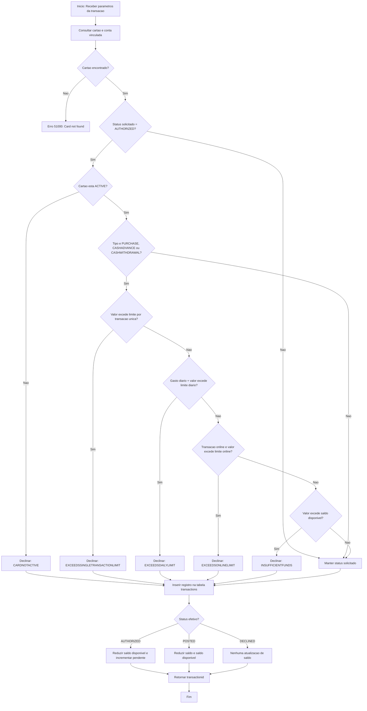

# Documentação: `card.spprocesstransaction`

## Visão Geral

| Atributo | Detalhe |
|---|---|
| **Aplicação** | NovoCard |
| **Schema** | `card` |
| **Tipo** | Stored Procedure |
| **Finalidade** | Registrar autorizações, postagens e reversões de transações de cartão, aplicando validações de limites e atualizando saldos da conta vinculada |
| **Moeda de Faturamento** | BRL (Real Brasileiro) |

A procedure é responsável pelo ciclo de vida de uma transação de cartão, desde a autorização até a efetivação (posting). Ela implementa uma cadeia de validações de segurança — status do cartão, limite por transação, limite diário, limite online e saldo disponível — antes de aceitar uma autorização. Caso qualquer validação falhe, a transação é automaticamente declinada com o motivo correspondente.

---

## Parâmetros

| Parâmetro | Tipo | Padrão | Direção | Descrição |
|---|---|---|---|---|
| `@pcardid` | `UNIQUEIDENTIFIER` | — | Entrada | Identificador do cartão sendo utilizado |
| `@pamount` | `DECIMAL(15,2)` | — | Entrada | Valor da transação na moeda de faturamento |
| `@ptransactiontype` | `NVARCHAR(30)` | `PURCHASE` | Entrada | Tipo da transação (`PURCHASE`, `CASHWITHDRAWAL`, `BALANCELOAD`, etc.) |
| `@pstatus` | `NVARCHAR(20)` | `AUTHORIZED` | Entrada | Status solicitado (`AUTHORIZED`, `POSTED`, `DECLINED`) |
| `@pmerchantname` | `NVARCHAR(255)` | `NULL` | Entrada | Nome de exibição do estabelecimento |
| `@pmerchantid` | `NVARCHAR(50)` | `NULL` | Entrada | Identificador do estabelecimento na adquirente |
| `@pmerchantcategorycode` | `CHAR(4)` | `NULL` | Entrada | Código MCC (ISO 18245) do estabelecimento |
| `@pauthorizationcode` | `NVARCHAR(20)` | `NULL` | Entrada | Código de autorização emitido pelo emissor |
| `@pisonline` | `BIT` | `0` | Entrada | Indica se a transação é online (cartão não presente) |
| `@pisinternational` | `BIT` | `0` | Entrada | Indica se a transação é internacional (cross-border) |
| `@piscontactless` | `BIT` | `0` | Entrada | Indica se a transação foi realizada via NFC (contactless) |
| `@pinstallments` | `SMALLINT` | `1` | Entrada | Número de parcelas (1 = à vista) |
| `@ptransactionid` | `UNIQUEIDENTIFIER` | — | **Saída** | Retorna o identificador único da transação criada |

---

## Tabelas Envolvidas

| Tabela | Operação | Finalidade |
|---|---|---|
| `card.cards` | Leitura | Obter o status atual do cartão |
| `card.cardaccounts` | Leitura / Atualização | Consultar saldo disponível e atualizar saldos após a transação |
| `card.cardlimits` | Leitura | Consultar limites configurados para o cartão |
| `card.transactions` | Leitura / Inserção | Calcular gasto diário acumulado e registrar a nova transação |

---

## Regras de Negócio

### Validações de Autorização

As validações abaixo são executadas **em sequência** apenas quando o status solicitado é `AUTHORIZED` e o tipo de transação é `PURCHASE`, `CASHADVANCE` ou `CASHWITHDRAWAL`. A primeira falha interrompe as verificações subsequentes e declina a transação.

| # | Validação | Motivo de Recusa |
|---|---|---|
| 1 | O cartão deve estar com status **ACTIVE** | `CARDNOTACTIVE` |
| 2 | O valor da transação não pode exceder o **limite por transação única** | `EXCEEDSSINGLETRANSACTIONLIMIT` |
| 3 | O acumulado do dia (mesmo tipo) somado ao valor atual não pode exceder o **limite diário** | `EXCEEDSDAILYLIMIT` |
| 4 | Para transações online, o valor não pode exceder o **limite de transação online** | `EXCEEDSONLINELIMIT` |
| 5 | O valor deve ser menor ou igual ao **saldo disponível** da conta | `INSUFFICIENTFUNDS` |

### Impacto nos Saldos da Conta

| Status Efetivo | Saldo (`balance`) | Saldo Disponível (`availablebalance`) | Valor Pendente (`pendingamount`) |
|---|---|---|---|
| `AUTHORIZED` | Sem alteração | **Reduzido** pelo valor da transação | **Incrementado** pelo valor da transação |
| `POSTED` | **Reduzido** pelo valor da transação | **Reduzido** pelo valor da transação | Sem alteração |
| `DECLINED` | Sem alteração | Sem alteração | Sem alteração |

---

## Process Flow

---

## Insights

- **Sem tratamento de transação explícito (BEGIN TRAN / COMMIT):** A procedure não gerencia uma transação de banco de dados explícita. Isso significa que, em caso de falha parcial (ex.: inserção bem-sucedida mas falha na atualização de saldo), pode haver inconsistência de dados. Recomenda-se encapsular as operações de escrita em uma transação explícita com `TRY/CATCH` e `ROLLBACK`.
- **Reversão (REVERSED) mencionada mas não implementada:** A descrição da procedure menciona o cenário de reversão (`REVERSED`) que liberaria o hold de volta ao saldo disponível, porém o código atual não contém lógica para esse status. Transações com status `REVERSED` seriam apenas registradas sem qualquer ajuste de saldo.
- **Status POSTED não converte hold existente:** Quando uma transação é postada diretamente, o saldo (`balance`) e o saldo disponível (`availablebalance`) são reduzidos, mas o `pendingamount` não é decrementado. Isso pode causar divergência se a transação tiver passado previamente pelo status `AUTHORIZED`.
- **Hint OPTION(RECOMPILE):** A consulta inicial utiliza `OPTION(RECOMPILE)`, o que força a recompilação do plano de execução a cada chamada. Isso pode impactar a performance em cenários de alto volume transacional.
- **Cálculo do limite diário é segmentado por tipo de transação:** O acumulado diário considera apenas transações do mesmo `transactiontype`, permitindo que um cartão atinja o limite diário independentemente para compras e saques, por exemplo.
- **Parcelamento registrado mas sem lógica de divisão:** O número de parcelas (`installments`) é armazenado no registro da transação, mas não há lógica de divisão do valor em múltiplas parcelas ou criação de registros futuros de cobrança.
- **Ausência de controle de concorrência explícito:** Embora a descrição mencione "update lock", o código não utiliza hints de bloqueio (`WITH (UPDLOCK)`) na consulta de saldo, o que pode permitir condições de corrida em autorizações simultâneas para o mesmo cartão.
