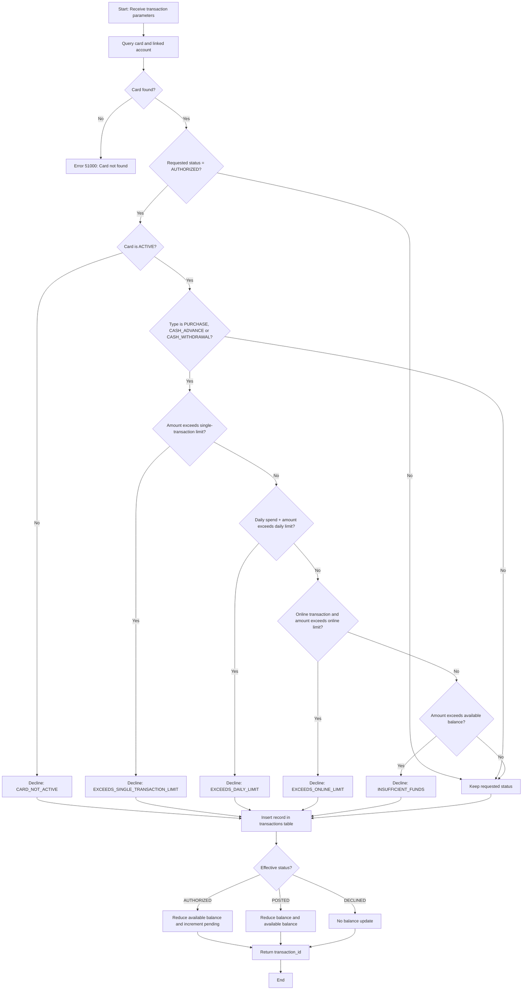

# Documentation: `card.sp_process_transaction`

## Overview

| Attribute | Detail |
|---|---|
| **Application** | NovoCard |
| **Schema** | `card` |
| **Type** | Stored Procedure |
| **Purpose** | Record card transaction authorizations, postings, and reversals, applying limit validations and updating balances on the linked account |
| **Billing Currency** | USD |

The procedure manages the full card transaction lifecycle, from authorization through posting. It implements a chain of security validations — card status, single-transaction limit, daily limit, online limit, and available balance — before accepting an authorization. If any validation fails, the transaction is automatically declined with the corresponding reason.

---

## Parameters

| Parameter | Type | Default | Direction | Description |
|---|---|---|---|---|
| `@p_card_id` | `UNIQUEIDENTIFIER` | — | Input | Identifier of the card being used |
| `@p_amount` | `DECIMAL(15,2)` | — | Input | Transaction amount in the billing currency |
| `@p_transaction_type` | `NVARCHAR(30)` | `PURCHASE` | Input | Transaction type (`PURCHASE`, `CASH_WITHDRAWAL`, `BALANCE_LOAD`, etc.) |
| `@p_status` | `NVARCHAR(20)` | `AUTHORIZED` | Input | Requested status (`AUTHORIZED`, `POSTED`, `DECLINED`) |
| `@p_merchant_name` | `NVARCHAR(255)` | `NULL` | Input | Merchant display name |
| `@p_merchant_id` | `NVARCHAR(50)` | `NULL` | Input | Merchant identifier at the acquirer |
| `@p_merchant_category_code` | `CHAR(4)` | `NULL` | Input | Merchant MCC code (ISO 18245) |
| `@p_authorization_code` | `NVARCHAR(20)` | `NULL` | Input | Authorization code issued by the issuer |
| `@p_is_online` | `BIT` | `0` | Input | Indicates whether the transaction is online (card-not-present) |
| `@p_is_international` | `BIT` | `0` | Input | Indicates whether the transaction is international (cross-border) |
| `@p_is_contactless` | `BIT` | `0` | Input | Indicates whether the transaction was performed via NFC (contactless) |
| `@p_installments` | `SMALLINT` | `1` | Input | Number of installments (1 = single payment) |
| `@p_transaction_id` | `UNIQUEIDENTIFIER` | — | **Output** | Returns the unique identifier of the created transaction |

---

## Tables Involved

| Table | Operation | Purpose |
|---|---|---|
| `card.cards` | Read | Obtain the current card status |
| `card.card_accounts` | Read / Update | Query available balance and update balances after the transaction |
| `card.card_limits` | Read | Query configured limits for the card |
| `card.transactions` | Read / Insert | Calculate accumulated daily spend and record the new transaction |

---

## Business Rules

### Authorization Validations

The validations below are executed **in sequence** only when the requested status is `AUTHORIZED` and the transaction type is `PURCHASE`, `CASH_ADVANCE`, or `CASH_WITHDRAWAL`. The first failure stops subsequent checks and declines the transaction.

| # | Validation | Decline Reason |
|---|---|---|
| 1 | The card must have **ACTIVE** status | `CARD_NOT_ACTIVE` |
| 2 | The transaction amount cannot exceed the **single-transaction limit** | `EXCEEDS_SINGLE_TRANSACTION_LIMIT` |
| 3 | The daily accumulated amount (same type) plus the current amount cannot exceed the **daily limit** | `EXCEEDS_DAILY_LIMIT` |
| 4 | For online transactions, the amount cannot exceed the **online transaction limit** | `EXCEEDS_ONLINE_LIMIT` |
| 5 | The amount must be less than or equal to the account's **available balance** | `INSUFFICIENT_FUNDS` |

### Impact on Account Balances

| Effective Status | Balance (`balance`) | Available Balance (`available_balance`) | Pending Amount (`pending_amount`) |
|---|---|---|---|
| `AUTHORIZED` | No change | **Reduced** by the transaction amount | **Incremented** by the transaction amount |
| `POSTED` | **Reduced** by the transaction amount | **Reduced** by the transaction amount | No change |
| `DECLINED` | No change | No change | No change |

---

## Process Flow

---

## Insights

- **No explicit transaction management (BEGIN TRAN / COMMIT):** The procedure does not manage an explicit database transaction. This means that in the event of a partial failure (e.g., successful insert but failed balance update), data inconsistency may occur. It is recommended to wrap the write operations in an explicit transaction with `TRY/CATCH` and `ROLLBACK`.
- **REVERSED status mentioned but not implemented:** The procedure description mentions a reversal scenario (`REVERSED`) that would release the hold back to the available balance, but the current code does not contain logic for this status. Transactions with `REVERSED` status would only be recorded without any balance adjustment.
- **POSTED status does not convert existing hold:** When a transaction is posted directly, the `balance` and `available_balance` are reduced, but `pending_amount` is not decremented. This may cause divergence if the transaction previously went through `AUTHORIZED` status.
- **OPTION(RECOMPILE) hint:** The initial query uses `OPTION(RECOMPILE)`, which forces execution plan recompilation on every call. This may impact performance in high transaction volume scenarios.
- **Daily limit calculation is segmented by transaction type:** The daily accumulation considers only transactions of the same `transaction_type`, allowing a card to independently reach the daily limit for purchases and withdrawals, for example.
- **Installments recorded but without split logic:** The number of installments (`installments`) is stored in the transaction record, but there is no logic to split the amount into multiple installments or create future billing records.
- **No explicit concurrency control:** Although the description mentions "update lock", the code does not use locking hints (`WITH (UPDLOCK)`) when querying the balance, which may allow race conditions in simultaneous authorizations for the same card.
