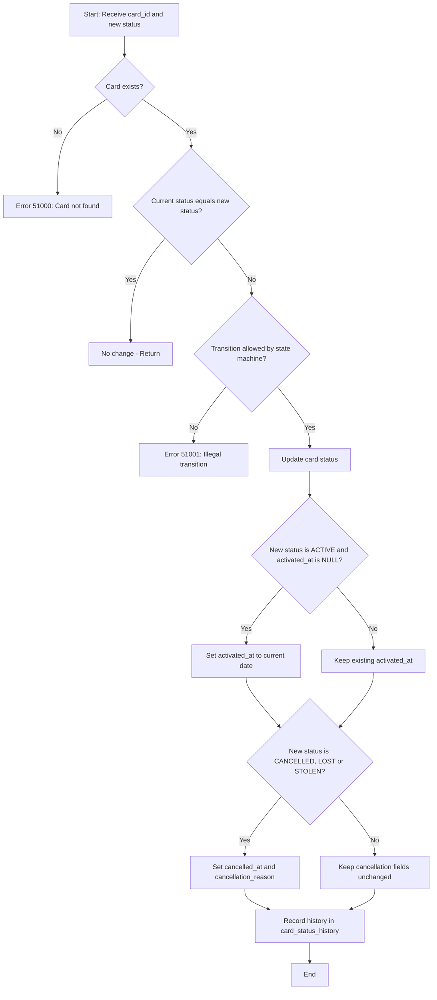

# card.sp_update_card_status

## Overview

Stored procedure responsible for managing card status transitions in the **NovoCard** application. Implements a state machine that ensures only valid transitions are executed, recording each change in an audit history.

Used by the **block/unblock**, **fraud response**, and **card cancellation** workflows.

---

## Parameters

| Parameter | Type | Required | Default | Description |
|---|---|---|---|---|
| `@p_card_id` | UNIQUEIDENTIFIER | Yes | — | Unique card identifier |
| `@p_new_status` | NVARCHAR(30) | Yes | — | Desired new status for the card |
| `@p_reason` | NVARCHAR(255) | No | NULL | Reason for the status change |
| `@p_initiated_by` | NVARCHAR(20) | No | `'SYSTEM'` | Origin of the request (system, operator, etc.) |
| `@p_operator_id` | NVARCHAR(100) | No | NULL | Identifier of the operator who initiated the action |
| `@p_channel` | NVARCHAR(20) | No | `'API'` | Channel through which the request was made |

---

## State Machine — Allowed Transitions

| Current Status | Allowed Target Status(es) |
|---|---|
| PENDING_ACTIVATION | ACTIVE |
| ACTIVE | BLOCKED_TEMPORARY, BLOCKED_FRAUD, CANCELLED, LOST, STOLEN, EXPIRED |
| BLOCKED_TEMPORARY | ACTIVE, BLOCKED_FRAUD, CANCELLED |
| BLOCKED_FRAUD | CANCELLED |
| LOST | CANCELLED |
| STOLEN | CANCELLED |

> Any transition outside this table is considered **illegal** and results in an error (code 51001).

---

## Business Rules

1. **Card not found**: If the provided `card_id` is not found in `card.cards`, the procedure throws error 51000 (*Card not found*).

2. **Identical status**: If the card is already in the requested status, no change is made and execution ends silently.

3. **Illegal transition**: Transition attempts not defined in the state machine throw error 51001 with a message detailing the current and requested status.

4. **Activation date** (`activated_at`): Populated automatically only on the first transition to `ACTIVE` (when it is still `NULL`).

5. **Cancellation date and reason** (`cancelled_at`, `cancellation_reason`): Populated automatically when the new status is `CANCELLED`, `LOST`, or `STOLEN`.

6. **Audit**: Every successful transition is recorded in `card.card_status_history` with the previous status, new status, reason, origin, operator, and channel.

---

## Tables Involved

| Table | Operation | Purpose |
|---|---|---|
| `card.cards` | SELECT (with UPDLOCK, ROWLOCK) | Read current status with pessimistic lock to prevent concurrency issues |
| `card.cards` | UPDATE | Update status and related fields |
| `card.card_status_history` | INSERT | Audit record of the status transition |

---

## Error Handling

| Code | Message | Situation |
|---|---|---|
| 51000 | *Card not found.* | Card not found in the database |
| 51001 | *Illegal card status transition: [current] → [new]* | Transition not allowed by the state machine |

---

## Insights

- The use of `UPDLOCK` and `ROWLOCK` when reading the current status protects against race conditions in high-concurrency scenarios, ensuring two simultaneous requests do not apply conflicting transitions to the same card.
- The `LOST` and `STOLEN` statuses are treated as terminal states equivalent to `CANCELLED` in terms of populating date and reason, but are maintained as distinct statuses for classification and analysis purposes.
- The `EXPIRED` status is a possible destination from `ACTIVE` but has no outgoing transitions defined, making it effectively a terminal state.
- `BLOCKED_FRAUD` allows only the transition to `CANCELLED`, unlike `BLOCKED_TEMPORARY` which allows return to `ACTIVE`, reflecting the distinct severity of each block type.
- The `@p_initiated_by` field with a default value of `'SYSTEM'` allows tracking whether the action was automated or manual.

---

## Process Flow

