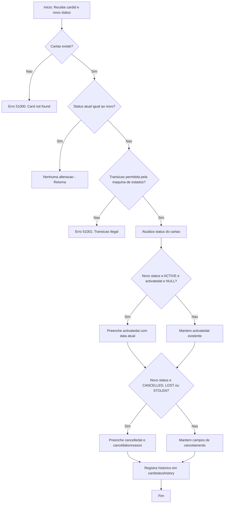

# card.spupdatecardstatus

## Visão Geral

Procedimento armazenado responsável por gerenciar as transições de status de cartões na aplicação **NovoCard**. Implementa uma máquina de estados que garante que apenas transições válidas sejam executadas, registrando cada mudança em um histórico de auditoria.

É utilizado pelos fluxos de **bloqueio/desbloqueio**, **resposta a fraude** e **cancelamento** de cartões.

---

## Parâmetros

| Parâmetro | Tipo | Obrigatório | Valor Padrão | Descrição |
|---|---|---|---|---|
| `@pcardid` | UNIQUEIDENTIFIER | Sim | — | Identificador único do cartão |
| `@pnewstatus` | NVARCHAR(30) | Sim | — | Novo status desejado para o cartão |
| `@preason` | NVARCHAR(255) | Não | NULL | Motivo da alteração de status |
| `@pinitiatedby` | NVARCHAR(20) | Não | `'SYSTEM'` | Origem da solicitação (sistema, operador, etc.) |
| `@poperatorid` | NVARCHAR(100) | Não | NULL | Identificador do operador que iniciou a ação |
| `@pchannel` | NVARCHAR(20) | Não | `'API'` | Canal pelo qual a solicitação foi realizada |

---

## Máquina de Estados — Transições Permitidas

| Status Atual | Status(es) de Destino Permitidos |
|---|---|
| PENDING_ACTIVATION | ACTIVE |
| ACTIVE | BLOCKED_TEMPORARY, BLOCKED_FRAUD, CANCELLED, LOST, STOLEN, EXPIRED |
| BLOCKED_TEMPORARY | ACTIVE, BLOCKED_FRAUD, CANCELLED |
| BLOCKED_FRAUD | CANCELLED |
| LOST | CANCELLED |
| STOLEN | CANCELLED |

> Qualquer transição fora desta tabela é considerada **ilegal** e resulta em erro (código 51001).

---

## Regras de Negócio

1. **Cartão inexistente**: Se o `cardid` informado não for encontrado na tabela `card.cards`, o procedimento lança o erro 51000 (*Card not found*).

2. **Status idêntico**: Se o cartão já estiver no status solicitado, nenhuma alteração é realizada e a execução é encerrada silenciosamente.

3. **Transição ilegal**: Tentativas de transição não previstas na máquina de estados geram o erro 51001 com mensagem detalhando o status atual e o status solicitado.

4. **Data de ativação** (`activatedat`): Preenchida automaticamente apenas na primeira transição para `ACTIVE` (quando ainda é `NULL`).

5. **Data e motivo de cancelamento** (`cancelledat`, `cancellationreason`): Preenchidos automaticamente quando o novo status é `CANCELLED`, `LOST` ou `STOLEN`.

6. **Auditoria**: Toda transição bem-sucedida é registrada na tabela `card.cardstatushistory` com o status anterior, novo status, motivo, origem, operador e canal.

---

## Tabelas Envolvidas

| Tabela | Operação | Finalidade |
|---|---|---|
| `card.cards` | SELECT (com UPDLOCK, ROWLOCK) | Leitura do status atual com bloqueio pessimista para evitar concorrência |
| `card.cards` | UPDATE | Atualização do status e campos relacionados |
| `card.cardstatushistory` | INSERT | Registro de auditoria da transição de status |

---

## Tratamento de Erros

| Código | Mensagem | Situação |
|---|---|---|
| 51000 | *Card not found.* | Cartão não localizado na base |
| 51001 | *Illegal card status transition: [atual] → [novo]* | Transição não permitida pela máquina de estados |

---

## Insights

- O uso de `UPDLOCK` e `ROWLOCK` na leitura do status atual protege contra condições de corrida em cenários de alta concorrência, garantindo que duas requisições simultâneas não apliquem transições conflitantes ao mesmo cartão.
- Os status `LOST` e `STOLEN` são tratados como estados terminais equivalentes ao `CANCELLED` em termos de preenchimento de data e motivo, mas são mantidos como status distintos para fins de classificação e análise.
- O status `EXPIRED` é um destino possível a partir de `ACTIVE`, porém não possui transições de saída definidas, sendo efetivamente um estado terminal.
- `BLOCKED_FRAUD` permite apenas a transição para `CANCELLED`, diferentemente de `BLOCKED_TEMPORARY` que permite retorno a `ACTIVE`, refletindo a severidade distinta de cada tipo de bloqueio.
- O campo `@pinitiatedby` com valor padrão `'SYSTEM'` permite rastrear se a ação foi automatizada ou manual.

---

## Process Flow

