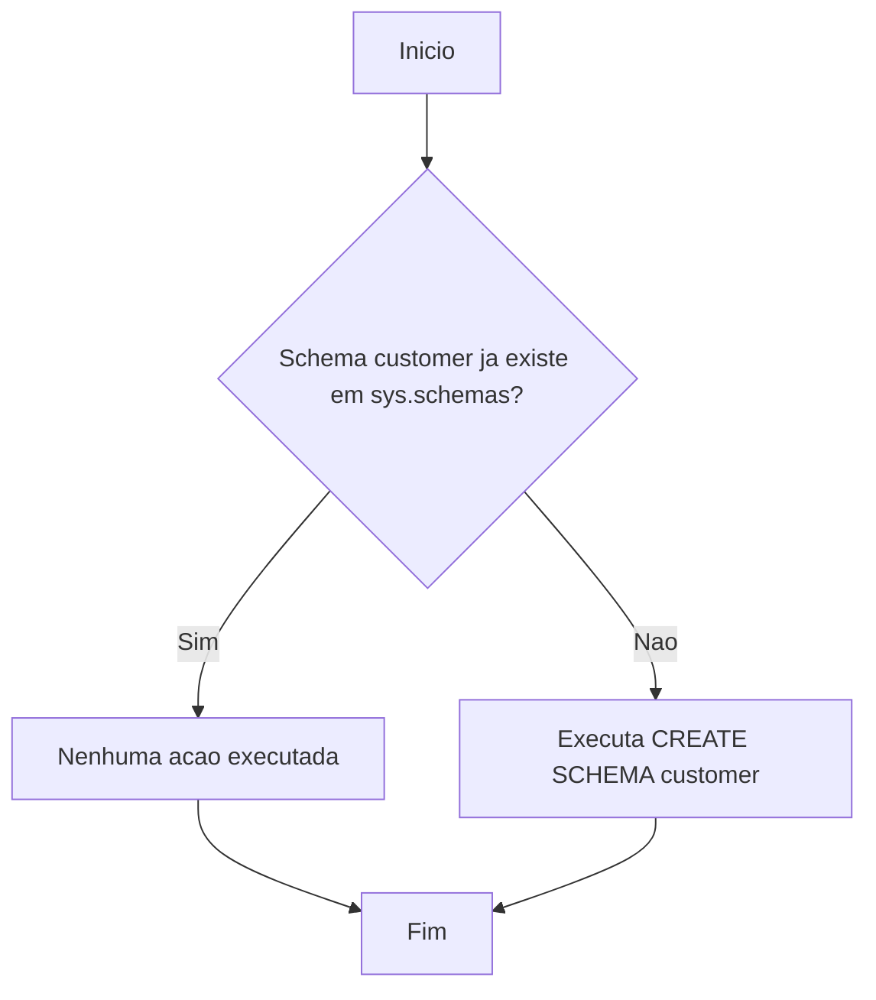

# Documentação: Schema `customer`

## Visão Geral

| Atributo       | Detalhe                                                                 |
|----------------|-------------------------------------------------------------------------|
| **Nome**       | `customer`                                                              |
| **Aplicação**  | NovoCard                                                                |
| **Tipo**       | Estrutura de Dados (Schema)                                             |
| **Descrição**  | Armazena todas as informações de identidade e contato dos clientes.     |

## Descrição

O schema `customer` é uma estrutura organizacional no banco de dados da aplicação **NovoCard**, destinada a agrupar todos os objetos (tabelas, views, procedures, etc.) relacionados aos dados cadastrais dos clientes.

Os clientes registrados neste schema podem possuir múltiplos cartões associados a diferentes tipos de produto.

## Detalhes Técnicos

| Aspecto                  | Descrição                                                                                      |
|--------------------------|------------------------------------------------------------------------------------------------|
| **Operação**             | Criação condicional do schema `customer`                                                       |
| **Verificação prévia**   | Consulta `sys.schemas` para verificar se o schema já existe antes de tentar criá-lo            |
| **Comportamento**        | O schema só é criado caso ainda não exista no banco de dados (criação idempotente)             |

## Fluxo do Processo

## Insights

- Este script é **idempotente**, ou seja, pode ser executado múltiplas vezes sem causar erro, pois verifica a existência do schema antes de criá-lo.
- O schema `customer` serve como **namespace lógico** para segregar objetos de banco de dados relacionados a clientes, promovendo organização e facilitando o controle de permissões de acesso.
- A aplicação **NovoCard** sugere um sistema de gestão de cartões, onde o domínio de clientes é um dos pilares centrais do modelo de dados.
- O relacionamento indicado entre clientes e múltiplos cartões de diferentes tipos de produto sugere que tabelas futuras dentro deste schema terão vínculos com estruturas de produtos e cartões.
