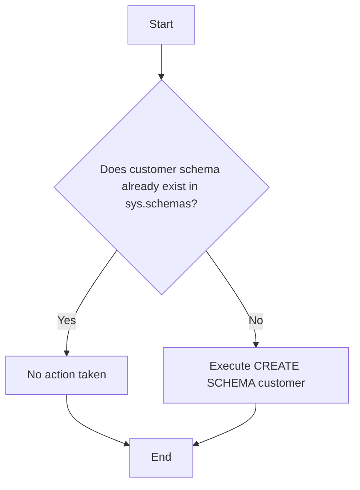

# Documentation: Schema `customer`

## Overview

| Attribute      | Detail                                                                  |
|----------------|-------------------------------------------------------------------------|
| **Name**       | `customer`                                                              |
| **Application**| NovoCard                                                                |
| **Type**       | Data Structure (Schema)                                                 |
| **Description**| Holds all customer identity and contact information.                    |

## Description

The `customer` schema is an organizational namespace in the **NovoCard** application database, grouping all objects (tables, views, procedures, etc.) related to customer registration data.

Customers registered in this schema can hold multiple cards associated with different product types.

## Technical Details

| Aspect                  | Description                                                                                       |
|-------------------------|---------------------------------------------------------------------------------------------------|
| **Operation**           | Conditional creation of the `customer` schema                                                     |
| **Pre-check**           | Queries `sys.schemas` to verify whether the schema already exists before attempting to create it  |
| **Behavior**            | The schema is only created if it does not yet exist in the database (idempotent creation)         |

## Process Flow

## Insights

- This script is **idempotent** — it can be executed multiple times without error, because it checks for the schema's existence before creating it.
- The `customer` schema serves as a **logical namespace** for segregating customer-related database objects, promoting organization and simplifying access-permission management.
- The **NovoCard** application is a card management system where the customer domain is one of the central pillars of the data model.
- The indicated relationship between customers and multiple cards of different product types implies that future tables within this schema will have links to product and card structures.
