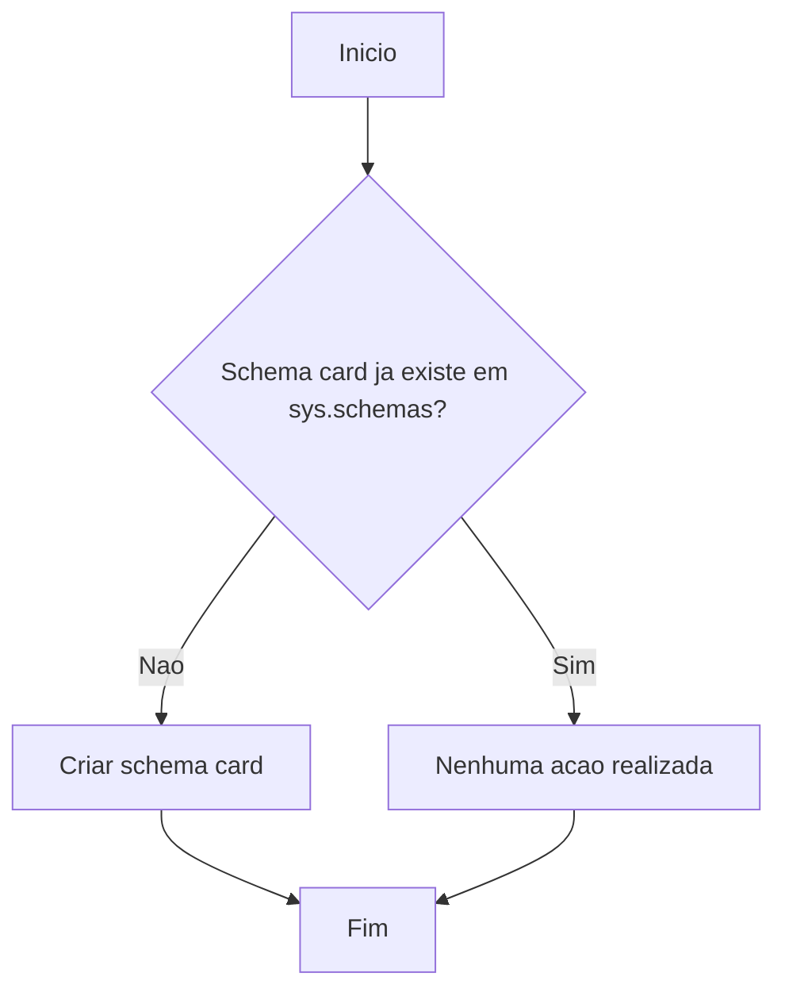

# Documentação: Schema `card`

## Visão Geral

| Atributo       | Detalhe                                                                                                    |
|----------------|------------------------------------------------------------------------------------------------------------|
| **Nome**       | `card`                                                                                                     |
| **Aplicação**  | NovoCard                                                                                                   |
| **Tipo**       | Estrutura de Dados (Schema)                                                                                |
| **Descrição**  | Schema central de gestão de cartões. Agrupa tipos de produtos de cartão, cartões emitidos, contas, limites de gastos, ciclo de vida de status e registros de transações. |

## Descrição

O schema `card` é a estrutura organizacional principal da aplicação **NovoCard**, responsável por agrupar todos os objetos de banco de dados relacionados à gestão do ciclo de vida de cartões. Ele serve como namespace lógico para as seguintes áreas de negócio:

| Área de Negócio          | Finalidade                                                        |
|--------------------------|-------------------------------------------------------------------|
| Produtos de Cartão       | Definição dos tipos de cartão disponíveis para emissão            |
| Cartões Emitidos         | Registro dos cartões efetivamente emitidos aos clientes           |
| Contas                   | Contas vinculadas aos cartões                                     |
| Limites de Gastos        | Controle dos limites de crédito e gastos permitidos               |
| Ciclo de Vida de Status  | Gerenciamento dos estados do cartão (ativo, bloqueado, cancelado) |
| Registros de Transações  | Histórico de transações realizadas com os cartões                 |

## Detalhes Técnicos

A criação do schema é realizada de forma **idempotente**, ou seja, verifica previamente a existência do schema `card` no catálogo de schemas do sistema (`sys.schemas`) antes de executar o comando de criação. Isso garante que a execução repetida do script não gere erros.

## Process Flow

## Insights

- Este schema é a **base estrutural** de toda a aplicação NovoCard — todos os objetos de dados relacionados a cartões devem residir dentro dele.
- A abordagem idempotente na criação é uma boa prática para scripts de implantação e migração, permitindo reexecução segura em diferentes ambientes (desenvolvimento, homologação, produção).
- Por ser apenas a criação do schema, nenhuma tabela, índice ou constraint é definida neste script — esses objetos são esperados em scripts subsequentes.
- A separação em schema dedicado facilita o controle de **permissões de acesso** por área de negócio, permitindo conceder ou restringir acesso ao domínio de cartões de forma granular.
