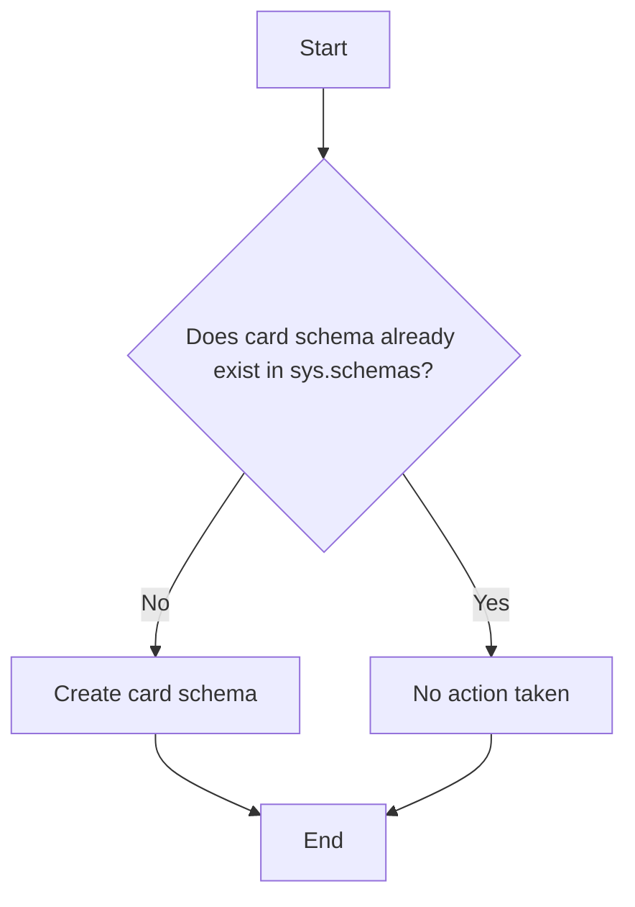

# Documentation: Schema `card`

## Overview

| Attribute      | Detail                                                                                                          |
|----------------|-----------------------------------------------------------------------------------------------------------------|
| **Name**       | `card`                                                                                                          |
| **Application**| NovoCard                                                                                                        |
| **Type**       | Data Structure (Schema)                                                                                         |
| **Description**| Core card management schema. Groups card product types, issued cards, accounts, spending limits, status lifecycle, and transaction records. |

## Description

The `card` schema is the primary organizational structure of the **NovoCard** application, responsible for grouping all database objects related to the card lifecycle. It serves as a logical namespace for the following business areas:

| Business Area         | Purpose                                                       |
|-----------------------|---------------------------------------------------------------|
| Card Products         | Definition of card types available for issuance              |
| Issued Cards          | Registry of cards actually issued to customers               |
| Accounts              | Accounts linked to cards                                      |
| Spending Limits       | Control of credit and spending limits                         |
| Status Lifecycle      | Management of card states (active, blocked, cancelled)        |
| Transaction Records   | History of transactions made with cards                       |

## Technical Details

Schema creation is performed **idempotently**: it first checks for the existence of the `card` schema in the system catalog (`sys.schemas`) before executing the creation command, ensuring that repeated script execution does not produce errors.

## Process Flow

## Insights

- This schema is the **structural foundation** of the entire NovoCard application — all card-related data objects must reside within it.
- The idempotent creation approach is a best practice for deployment and migration scripts, allowing safe re-execution across environments (development, staging, production).
- Because this is only the schema creation, no tables, indexes, or constraints are defined here — those objects are expected in subsequent scripts.
- Separating into a dedicated schema facilitates **granular access-permission control** by business area, enabling precise grant or restriction of access to the card domain.
