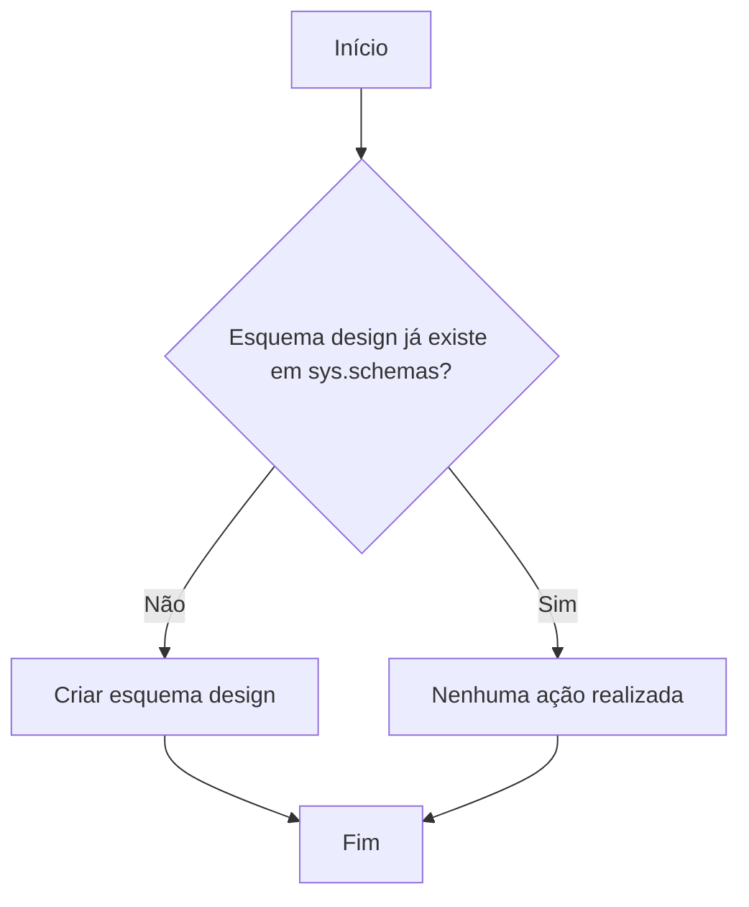

# Esquema de Dados: `design`

## Visão Geral

Este artefato define o esquema (namespace) **`design`** no banco de dados da aplicação **NovoCard**. O esquema é dedicado à **customização e branding de cartões**, armazenando templates de design, designs atribuídos a clientes e os ativos digitais que os compõem. Ele suporta a experiência de personalização para cartões de **crédito**, **débito** e **pré-pago**.

---

## Estrutura de Dados

| Elemento | Tipo | Descrição |
|---|---|---|
| `design` | Schema (namespace) | Esquema lógico que agrupa todos os objetos relacionados à personalização visual de cartões |

---

## Comportamento da Criação

O script realiza uma **criação condicional** do esquema `design`:

1. Verifica na view de sistema `sys.schemas` se já existe um esquema com o nome `design`.
2. Caso **não exista**, o esquema é criado.
3. Caso **já exista**, nenhuma ação é executada, evitando erros de duplicidade.

---

## Process Flow

---

## Insights

- O esquema `design` funciona como um **agrupador lógico** para todas as tabelas, views e demais objetos relacionados à personalização visual de cartões dentro do banco de dados.
- A abordagem de criação condicional (idempotente) garante que o script pode ser executado múltiplas vezes sem efeitos colaterais, o que é uma boa prática para scripts de implantação e migração.
- Este é um artefato **fundacional** — outros objetos do domínio de personalização de cartões (templates, designs atribuídos, ativos digitais) serão criados dentro deste esquema.
- A aplicação **NovoCard** utiliza separação por schemas para organizar domínios de negócio distintos, promovendo isolamento e clareza na estrutura do banco de dados.
