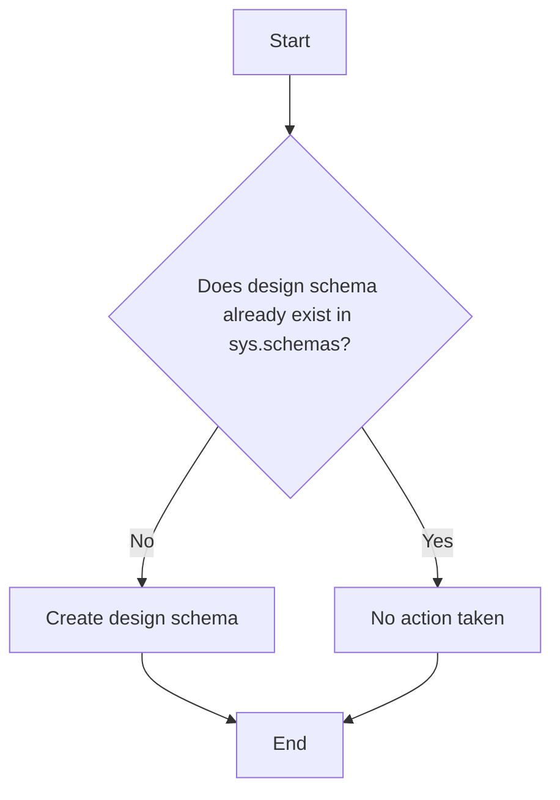

# Data Schema: `design`

## Overview

This artifact defines the **`design`** schema (namespace) in the **NovoCard** application database. The schema is dedicated to **card customization and branding**, storing design templates, customer-assigned designs, and the digital assets that compose them. It supports the personalization experience for **credit**, **debit**, and **prepaid** cards.

---

## Data Structure

| Element  | Type              | Description                                                                               |
|----------|-------------------|-------------------------------------------------------------------------------------------|
| `design` | Schema (namespace)| Logical schema grouping all objects related to the visual personalization of cards         |

---

## Creation Behavior

The script performs a **conditional creation** of the `design` schema:

1. Checks `sys.schemas` to determine whether a schema named `design` already exists.
2. If it **does not exist**, the schema is created.
3. If it **already exists**, no action is taken, avoiding duplicate errors.

---

## Process Flow

---

## Insights

- The `design` schema acts as a **logical grouper** for all tables, views, and other objects related to card visual personalization within the database.
- The conditional (idempotent) creation approach ensures the script can be executed multiple times without side effects — a best practice for deployment and migration scripts.
- This is a **foundational artifact** — other objects in the card personalization domain (templates, assigned designs, digital assets) will be created inside this schema.
- **NovoCard** uses schema separation to organize distinct business domains, promoting isolation and clarity in the database structure.
