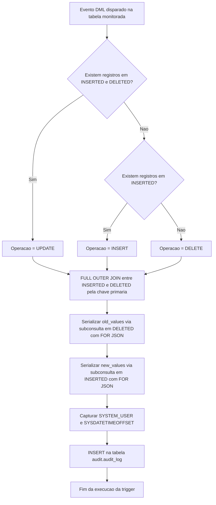

# Trigger de Auditoria de Status de Cartão — `trg_card_status_audit`

## Visão Geral

Conjunto de triggers pertencentes à aplicação **NovoCard** que implementam uma trilha de auditoria completa e à prova de adulteração sobre tabelas sensíveis do sistema. Cada trigger captura automaticamente todas as operações de **INSERT**, **UPDATE** e **DELETE**, gravando um snapshot JSON do registro afetado na tabela centralizada `audit.audit_log`. O objetivo principal é atender requisitos de **compliance regulatório** e viabilizar **análise forense** de dados.

---

## Tabelas Monitoradas

| Tabela de Origem | Schema | Chave Primária | Trigger Associada |
|---|---|---|---|
| `card.cards` | `card` | `card_id` | `trg_cards_audit` |
| `customer.customers` | `customer` | `customer_id` | `trg_customers_audit` |
| `design.card_designs` | `design` | `design_id` | `trg_card_designs_audit` |

---

## Tabela de Destino — `audit.audit_log`

Todas as triggers gravam na mesma tabela de auditoria com a seguinte estrutura de colunas:

| Coluna | Descrição |
|---|---|
| `schema_name` | Nome do schema da tabela de origem (ex.: `card`, `customer`, `design`) |
| `table_name` | Nome da tabela de origem (ex.: `cards`, `customers`, `card_designs`) |
| `operation` | Tipo da operação DML realizada: `INSERT`, `UPDATE` ou `DELETE` |
| `record_id` | Identificador único do registro afetado, convertido para `NVARCHAR(100)` |
| `old_values` | Snapshot JSON do registro **antes** da alteração (nulo em INSERT) |
| `new_values` | Snapshot JSON do registro **após** a alteração (nulo em DELETE) |
| `changed_by` | Usuário do sistema que executou a operação (`SYSTEM_USER`) |
| `changed_at` | Data e hora com fuso horário do momento da alteração (`SYSDATETIMEOFFSET`) |

---

## Lógica de Funcionamento

Todas as três triggers seguem exatamente a mesma lógica, diferindo apenas na tabela de origem e na chave primária utilizada:

1. **Determinação da operação**: A trigger verifica a existência de registros nas pseudo-tabelas `INSERTED` e `DELETED` para classificar a operação como `INSERT`, `UPDATE` ou `DELETE`.
2. **Junção completa**: Utiliza `FULL OUTER JOIN` entre `INSERTED` e `DELETED` pela chave primária, garantindo cobertura de todos os cenários (inclusão, alteração e exclusão).
3. **Serialização JSON**: Para cada linha afetada, subconsultas correlacionadas serializam os valores antigos e novos em formato JSON utilizando `FOR JSON AUTO, WITHOUT_ARRAY_WRAPPER`.
4. **Gravação do registro de auditoria**: Insere uma linha em `audit.audit_log` com todos os metadados e snapshots.

### Mapeamento de Operação

| Condição | Operação Classificada |
|---|---|
| Existem registros em `INSERTED` **e** em `DELETED` | `UPDATE` |
| Existem registros apenas em `INSERTED` | `INSERT` |
| Não existem registros em `INSERTED` | `DELETE` |

---

## Process Flow

---

## Insights

- **Abordagem set-based**: As triggers do SQL Server operam no nível de instrução, não por linha. A utilização de `FULL OUTER JOIN` com subconsultas correlacionadas garante que operações em lote (múltiplas linhas afetadas por um único comando DML) sejam auditadas corretamente, gerando um registro de auditoria por linha afetada.
- **Momento de disparo**: As triggers são configuradas como `AFTER`, ou seja, disparam somente após a efetivação da operação DML, garantindo que os valores capturados refletem o estado real dos dados.
- **Rastreabilidade completa**: A combinação de `old_values` e `new_values` em formato JSON permite identificar exatamente quais campos foram alterados em uma operação de `UPDATE`, facilitando comparações campo a campo.
- **Formato JSON sem wrapper de array**: O uso de `WITHOUT_ARRAY_WRAPPER` produz um objeto JSON simples (não encapsulado em array), simplificando o consumo posterior dos dados de auditoria.
- **Cobertura de compliance**: A captura do usuário responsável (`SYSTEM_USER`) e do timestamp com fuso horário (`SYSDATETIMEOFFSET`) atende requisitos comuns de normas regulatórias como PCI-DSS, que exigem rastreabilidade de quem alterou dados de cartão e quando.
- **Padrão replicável**: A estrutura idêntica das três triggers facilita a extensão do mecanismo de auditoria para novas tabelas sensíveis, bastando ajustar o nome da tabela, schema e chave primária.
- **Impacto em performance**: Toda operação DML nas tabelas monitoradas terá overhead adicional devido à serialização JSON e à inserção na tabela de auditoria. Para tabelas com alto volume transacional, é recomendável monitorar o impacto e considerar estratégias de particionamento ou arquivamento da tabela `audit.audit_log`.
