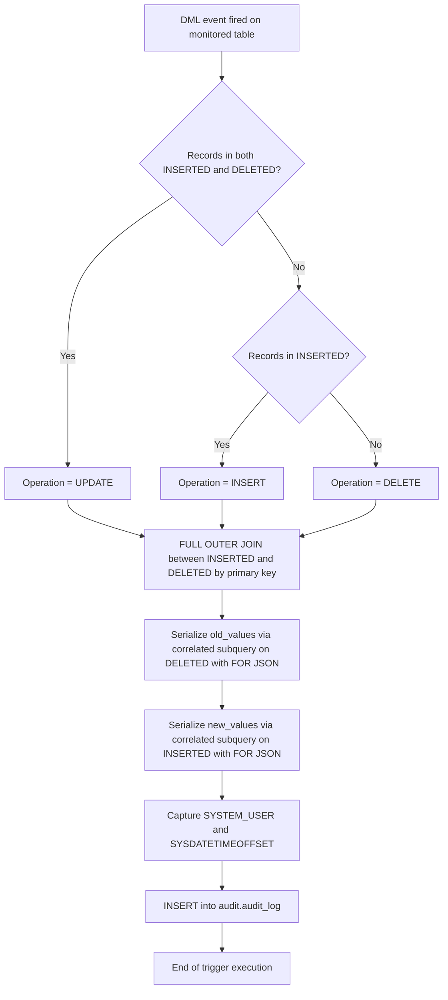

# Card Status Audit Trigger — `trg_card_status_audit`

## Overview

Set of triggers belonging to the **NovoCard** application that implement a complete, tamper-proof audit trail over sensitive system tables. Each trigger automatically captures all **INSERT**, **UPDATE**, and **DELETE** operations, writing a JSON snapshot of the affected record to the centralized `audit.audit_log` table. The primary objective is to satisfy **regulatory compliance** requirements and enable **forensic data analysis**.

---

## Monitored Tables

| Source Table | Schema | Primary Key | Associated Trigger |
|---|---|---|---|
| `card.cards` | `card` | `card_id` | `trg_cards_audit` |
| `customer.customers` | `customer` | `customer_id` | `trg_customers_audit` |
| `design.card_designs` | `design` | `design_id` | `trg_card_designs_audit` |

---

## Destination Table — `audit.audit_log`

All triggers write to the same audit table with the following column structure:

| Column | Description |
|---|---|
| `schema_name` | Name of the source table's schema (e.g., `card`, `customer`, `design`) |
| `table_name` | Name of the source table (e.g., `cards`, `customers`, `card_designs`) |
| `operation` | Type of DML operation performed: `INSERT`, `UPDATE`, or `DELETE` |
| `record_id` | Unique identifier of the affected record, cast to `NVARCHAR(100)` |
| `old_values` | JSON snapshot of the record **before** the change (null on INSERT) |
| `new_values` | JSON snapshot of the record **after** the change (null on DELETE) |
| `changed_by` | System user who executed the operation (`SYSTEM_USER`) |
| `changed_at` | Date and time with time zone of the change (`SYSDATETIMEOFFSET`) |

---

## Logic

All three triggers follow exactly the same logic, differing only in the source table and primary key used:

1. **Operation detection**: The trigger checks for records in the `INSERTED` and `DELETED` pseudo-tables to classify the operation as `INSERT`, `UPDATE`, or `DELETE`.
2. **Full join**: Uses a `FULL OUTER JOIN` between `INSERTED` and `DELETED` by primary key, ensuring coverage of all scenarios (insert, update, and delete).
3. **JSON serialization**: For each affected row, correlated subqueries serialize the old and new values into JSON format using `FOR JSON AUTO, WITHOUT_ARRAY_WRAPPER`.
4. **Audit record insertion**: Inserts one row in `audit.audit_log` with all metadata and snapshots.

### Operation Mapping

| Condition | Classified Operation |
|---|---|
| Records exist in both `INSERTED` **and** `DELETED` | `UPDATE` |
| Records exist only in `INSERTED` | `INSERT` |
| No records in `INSERTED` | `DELETE` |

---

## Process Flow

---

## Insights

- **Set-based approach**: SQL Server triggers operate at the statement level, not per row. The use of `FULL OUTER JOIN` with correlated subqueries ensures that batch operations (multiple rows affected by a single DML command) are correctly audited, generating one audit record per affected row.
- **Firing time**: The triggers are configured as `AFTER`, meaning they fire only after the DML operation has been committed, ensuring the captured values reflect the actual state of the data.
- **Complete traceability**: The combination of `old_values` and `new_values` in JSON format allows identifying exactly which fields were changed in an `UPDATE` operation, facilitating field-by-field comparisons.
- **JSON without array wrapper**: The use of `WITHOUT_ARRAY_WRAPPER` produces a simple JSON object (not wrapped in an array), simplifying subsequent consumption of audit data.
- **Compliance coverage**: Capturing the responsible user (`SYSTEM_USER`) and the timestamp with time zone (`SYSDATETIMEOFFSET`) satisfies common requirements of regulatory standards such as PCI-DSS, which require traceability of who changed card data and when.
- **Replicable pattern**: The identical structure of the three triggers facilitates extending the audit mechanism to new sensitive tables — simply adjust the table name, schema, and primary key.
- **Performance impact**: Every DML operation on monitored tables will incur additional overhead due to JSON serialization and insertion into the audit table. For high-volume tables, monitoring the impact and considering partitioning or archiving strategies for `audit.audit_log` is recommended.
