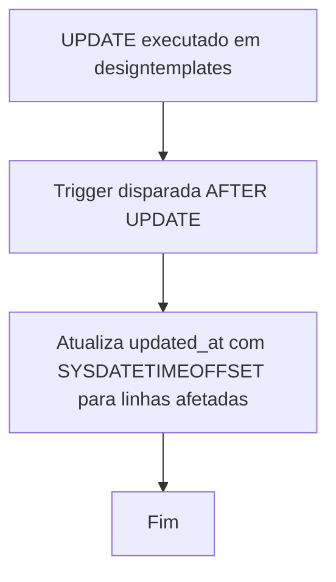
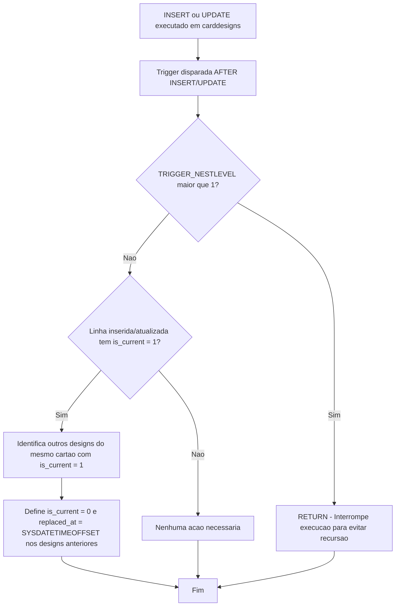

# Triggers de Controle de Versão de Design de Cartões

## Visão Geral

Este conjunto de triggers pertence à aplicação **NovoCard** e atua sobre o schema `design`, implementando duas regras de negócio fundamentais para o gerenciamento de templates e designs de cartões:

1. **Atualização automática de timestamp** em templates de design.
2. **Garantia de design único corrente** por cartão.

---

## Objetos Envolvidos

| Tipo | Schema | Objeto | Trigger Associada |
|------|--------|--------|-------------------|
| Tabela | `design` | `designtemplates` | `trg_template_updated_at` |
| Tabela | `design` | `carddesigns` | `trg_enforce_single_current_design` |

---

## Trigger 1 — `trg_template_updated_at`

### Objetivo

Mantém a coluna `updated_at` da tabela `design.designtemplates` sempre atualizada com a data/hora corrente (incluindo fuso horário) sempre que qualquer campo do registro for modificado, **sem exigir que o chamador informe esse valor explicitamente**.

### Comportamento

| Evento | Ação |
|--------|------|
| `AFTER UPDATE` em `designtemplates` | Atualiza `updated_at` com `SYSDATETIMEOFFSET()` para todas as linhas afetadas pelo `UPDATE` |

### Regra de Negócio

> Todo template de design deve registrar automaticamente o momento exato de sua última modificação, garantindo rastreabilidade e auditoria sem depender da aplicação.

---

## Trigger 2 — `trg_enforce_single_current_design`

### Objetivo

Garante a invariante de negócio de que **apenas um design pode estar marcado como corrente (`is_current = 1`) por cartão** a qualquer momento. Quando um novo design é inserido ou atualizado com `is_current = 1`, todos os demais designs do mesmo cartão são automaticamente desativados.

### Comportamento

| Evento | Condição | Ação |
|--------|----------|------|
| `AFTER INSERT` ou `AFTER UPDATE` em `carddesigns` | `is_current = 1` na linha inserida/atualizada | Define `is_current = 0` e preenche `replaced_at` com `SYSDATETIMEOFFSET()` em todos os **outros** designs do mesmo cartão que estavam correntes |
| Qualquer evento | `TRIGGER_NESTLEVEL() > 1` (chamada recursiva) | Retorna imediatamente sem executar ação |

### Mecanismo Anti-Recursão

A trigger utiliza `TRIGGER_NESTLEVEL()` para detectar se está sendo disparada recursivamente (ou seja, quando o próprio `UPDATE` interno da trigger causa um novo disparo). Se o nível de aninhamento for maior que 1, a execução é interrompida imediatamente, evitando loops infinitos.

### Regra de Negócio

> Cada cartão pode ter múltiplos designs ao longo do tempo, mas **somente um design pode ser o design vigente**. Ao promover um novo design como corrente, o sistema automaticamente aposenta o design anterior, registrando a data/hora da substituição.

---

## Fluxo de Processo

### Trigger `trg_template_updated_at`

### Trigger `trg_enforce_single_current_design`

---

## Colunas Impactadas

| Tabela | Coluna | Modificada por | Descrição |
|--------|--------|----------------|-----------|
| `designtemplates` | `updated_at` | `trg_template_updated_at` | Timestamp da última modificação do template |
| `carddesigns` | `is_current` | `trg_enforce_single_current_design` | Indicador de design vigente (0 ou 1) |
| `carddesigns` | `replaced_at` | `trg_enforce_single_current_design` | Data/hora em que o design deixou de ser o corrente |

---

## Insights

- A implementação da regra de design único corrente **no nível do banco de dados** garante integridade mesmo que múltiplas aplicações ou processos acessem a base simultaneamente, eliminando a dependência de lógica aplicacional para manter essa invariante.
- O uso de `SYSDATETIMEOFFSET()` em vez de `GETDATE()` ou `SYSUTCDATETIME()` indica que a aplicação opera em contexto onde a **informação de fuso horário é relevante**, possivelmente atendendo a operações em múltiplas regiões geográficas.
- O campo `replaced_at` cria um **histórico natural de versões** de design por cartão, permitindo consultas de auditoria sobre quando cada design foi substituído.
- A estratégia de `TRIGGER_NESTLEVEL` é eficaz, porém deve-se ter atenção caso outras triggers sejam encadeadas sobre a mesma tabela, pois o nível de aninhamento seria incrementado mesmo em cenários não recursivos.
- Não há índice ou constraint `UNIQUE` filtrada mencionada para reforçar a regra de unicidade de `is_current = 1` por cartão. Considerar a criação de um **índice único filtrado** (`WHERE is_current = 1`) como camada adicional de proteção seria uma boa prática complementar.
