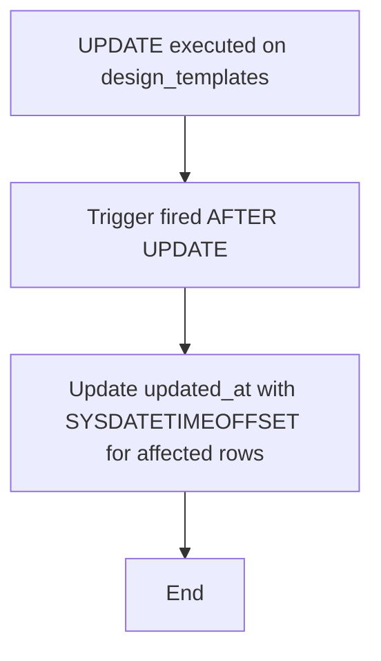

# Card Design Version Control Triggers

## Overview

This set of triggers belongs to the **NovoCard** application and operates on the `design` schema, implementing two fundamental business rules for managing card templates and designs:

1. **Automatic timestamp update** on design templates.
2. **Single current design guarantee** per card.

---

## Objects Involved

| Type | Schema | Object | Associated Trigger |
|------|--------|--------|--------------------|
| Table | `design` | `design_templates` | `trg_template_updated_at` |
| Table | `design` | `card_designs` | `trg_enforce_single_current_design` |

---

## Trigger 1 — `trg_template_updated_at`

### Purpose

Keeps the `updated_at` column of the `design.design_templates` table always up to date with the current date/time (including time zone) whenever any field in the record is modified, **without requiring the caller to explicitly provide this value**.

### Behavior

| Event | Action |
|-------|--------|
| `AFTER UPDATE` on `design_templates` | Updates `updated_at` with `SYSDATETIMEOFFSET()` for all rows affected by the `UPDATE` |

### Business Rule

> Every design template must automatically record the exact moment of its last modification, ensuring traceability and auditability without relying on the application layer.

---

## Trigger 2 — `trg_enforce_single_current_design`

### Purpose

Enforces the business invariant that **only one design can be marked as current (`is_current = 1`) per card** at any given time. When a new design is inserted or updated with `is_current = 1`, all other designs for the same card are automatically deactivated.

### Behavior

| Event | Condition | Action |
|-------|-----------|--------|
| `AFTER INSERT` or `AFTER UPDATE` on `card_designs` | `is_current = 1` on the inserted/updated row | Sets `is_current = 0` and populates `replaced_at` with `SYSDATETIMEOFFSET()` on all **other** designs for the same card that were current |
| Any event | `@@NESTLEVEL > 1` (recursive call) | Returns immediately without executing any action |

### Anti-Recursion Mechanism

The trigger uses `@@NESTLEVEL` to detect whether it is being fired recursively (i.e., when the trigger's own internal `UPDATE` causes a new firing). If the nesting level is greater than 1, execution stops immediately, preventing infinite loops.

### Business Rule

> Each card can have multiple designs over time, but **only one design can be the current design**. When promoting a new design as current, the system automatically retires the previous design, recording the date/time of replacement.

---

## Process Flow

### Trigger `trg_template_updated_at`



### Trigger `trg_enforce_single_current_design`

```mermaid
graph TD
    A[INSERT or UPDATE executed on card_designs] --> B[Trigger fired AFTER INSERT/UPDATE]
    B --> C{@@NESTLEVEL greater than 1?}
    C -- Yes --> D[RETURN - Stop execution to prevent recursion]
    C -- No --> E{Inserted/updated row has is_current = 1?}
    E -- No --> F[No action needed]
    E -- Yes --> G[Identify other designs for the same card with is_current = 1]
    G --> H[Set is_current = 0 and replaced_at = SYSDATETIMEOFFSET on previous designs]
    H --> I[End]
    F --> I
    D --> I
```

---

## Impacted Columns

| Table | Column | Modified by | Description |
|-------|--------|-------------|-------------|
| `design_templates` | `updated_at` | `trg_template_updated_at` | Timestamp of the last template modification |
| `card_designs` | `is_current` | `trg_enforce_single_current_design` | Current design indicator (0 or 1) |
| `card_designs` | `replaced_at` | `trg_enforce_single_current_design` | Date/time when the design ceased to be current |

---

## Insights

- Implementing the single-current-design rule **at the database level** guarantees integrity even when multiple applications or processes access the database simultaneously, eliminating reliance on application logic to maintain this invariant.
- The use of `SYSDATETIMEOFFSET()` instead of `GETDATE()` or `SYSUTCDATETIME()` indicates that the application operates in a context where **time zone information is relevant**, possibly serving operations across multiple geographic regions.
- The `replaced_at` field creates a **natural version history** of designs per card, enabling audit queries about when each design was replaced.
- The `@@NESTLEVEL` strategy is effective, but care should be taken if other triggers are chained on the same table, as the nesting level would be incremented even in non-recursive scenarios.
- No filtered unique index or `UNIQUE` constraint is mentioned to reinforce the uniqueness rule of `is_current = 1` per card. Adding a **filtered unique index** (`WHERE is_current = 1`) as an additional protection layer would be a complementary best practice.
