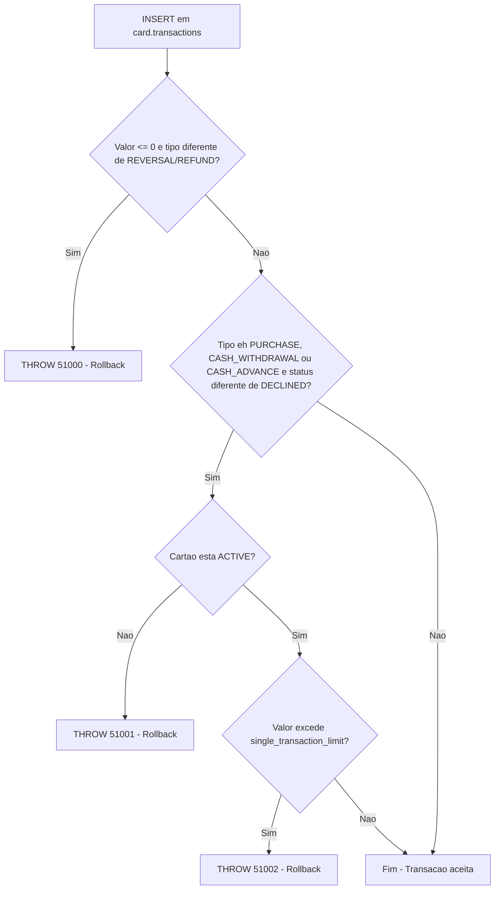

# Trigger: trg_transaction_limit_check

## Visão Geral

| Atributo | Valor |
|----------|-------|
| **Aplicação** | NovoCard |
| **Tipo** | Trigger (AFTER INSERT) |
| **Tabela** | `card.transactions` |
| **Banco de Dados** | SQL Server |

Esta trigger atua como uma **camada de segurança no nível do banco de dados**, realizando validações finais sobre registros de transações inseridos na tabela `card.transactions`. Ela opera de forma independente das validações já existentes na camada de aplicação (procedimento `sp_process_transaction`), garantindo integridade mesmo em cenários de inserção direta.

---

## Regras de Negócio

| # | Validação | Tipos de Transação Aplicáveis | Código de Erro | Mensagem |
|---|-----------|-------------------------------|----------------|----------|
| 1 | O valor da transação deve ser positivo | Todos, **exceto** REVERSAL e REFUND | 51000 | Transaction amount must be positive for this transaction type. |
| 2 | O cartão associado deve estar com status ACTIVE | PURCHASE, CASH_WITHDRAWAL, CASH_ADVANCE | 51001 | Cannot post transaction to an inactive card. |
| 3 | O valor não pode exceder o limite por transação individual | PURCHASE, CASH_WITHDRAWAL, CASH_ADVANCE | 51002 | Transaction amount exceeds single-transaction limit. |

---

## Detalhamento das Validações

### 1. Valor Positivo Obrigatório

Transações com valor menor ou igual a zero são rejeitadas, a menos que sejam do tipo **REVERSAL** ou **REFUND** (que naturalmente podem ter valores negativos ou zerados por representarem devoluções).

### 2. Cartão Ativo

Para transações de débito (compras, saques e adiantamentos em dinheiro), o cartão precisa estar com status **ACTIVE**. Transações já marcadas como **DECLINED** são ignoradas nesta verificação, pois já foram recusadas previamente.

### 3. Limite por Transação Individual

O valor da transação é comparado ao campo `single_transaction_limit` da tabela `card.card_limits`. Se o valor exceder esse teto, a transação é rejeitada. Novamente, registros já com status DECLINED são desconsiderados.

---

## Tabelas Envolvidas

| Tabela | Papel |
|--------|-------|
| `card.transactions` | Tabela alvo da trigger (registros inseridos) |
| `card.cards` | Consulta do status do cartão |
| `card.card_limits` | Consulta do limite por transação individual |

---

## Process Flow

---

## Insights

- O uso de `THROW` dentro de uma trigger provoca automaticamente o **rollback completo** da transação SQL em andamento, impedindo que o registro inválido persista.
- A trigger é do tipo **AFTER INSERT**, o que garante que as constraints da própria tabela (chaves primárias, foreign keys, NOT NULL, etc.) sejam verificadas **antes** da lógica customizada ser executada.
- A exclusão de registros com status `DECLINED` nas verificações 2 e 3 indica que o sistema permite a inserção de transações já recusadas para fins de auditoria/histórico, sem que a trigger as bloqueie novamente.
- Tipos como **REVERSAL** e **REFUND** possuem tratamento diferenciado, refletindo a natureza de estorno dessas operações.
- Esta trigger funciona como uma **rede de segurança** (safety net), protegendo contra cenários onde a camada de aplicação possa ser contornada ou falhar silenciosamente.
