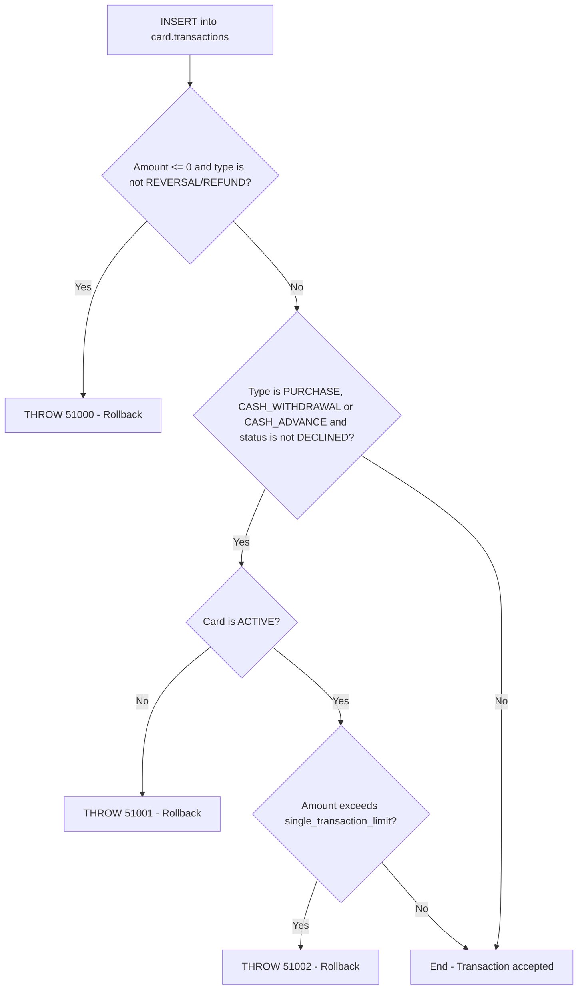

# Trigger: trg_transaction_limit_check

## Overview

| Attribute | Value |
|----------|-------|
| **Application** | NovoCard |
| **Type** | Trigger (AFTER INSERT) |
| **Table** | `card.transactions` |
| **Database** | SQL Server |

This trigger acts as a **database-level safety layer**, performing final validations on transaction records inserted into the `card.transactions` table. It operates independently from the validations already in place at the application layer (procedure `sp_process_transaction`), guaranteeing integrity even in direct-insert scenarios.

---

## Business Rules

| # | Validation | Applicable Transaction Types | Error Code | Message |
|---|-----------|-------------------------------|------------|---------|
| 1 | Transaction amount must be positive | All types **except** REVERSAL and REFUND | 51000 | Transaction amount must be positive for this transaction type. |
| 2 | The associated card must have ACTIVE status | PURCHASE, CASH_WITHDRAWAL, CASH_ADVANCE | 51001 | Cannot post transaction to an inactive card. |
| 3 | Amount cannot exceed the single-transaction limit | PURCHASE, CASH_WITHDRAWAL, CASH_ADVANCE | 51002 | Transaction amount exceeds single-transaction limit. |

---

## Validation Details

### 1. Positive Amount Required

Transactions with an amount less than or equal to zero are rejected, unless they are of type **REVERSAL** or **REFUND** (which may naturally have negative or zero amounts as they represent returns/credits).

### 2. Active Card

For debit transactions (purchases, withdrawals, and cash advances), the card must have **ACTIVE** status. Transactions already marked as **DECLINED** are excluded from this check, since they were already rejected upstream.

### 3. Single-Transaction Limit

The transaction amount is compared against the `single_transaction_limit` field in `card.card_limits`. If the amount exceeds this ceiling, the transaction is rejected. Again, records already with DECLINED status are excluded.

---

## Tables Involved

| Table | Role |
|--------|------|
| `card.transactions` | Trigger's target table (inserted records) |
| `card.cards` | Query for card status |
| `card.card_limits` | Query for single-transaction limit |

---

## Process Flow

---

## Insights

- Using `THROW` inside a trigger automatically causes a **complete rollback** of the current SQL transaction, preventing the invalid record from persisting.
- The trigger is of type **AFTER INSERT**, which guarantees that the table's own constraints (primary keys, foreign keys, NOT NULL, etc.) are verified **before** the custom logic executes.
- Excluding records with `DECLINED` status from checks 2 and 3 indicates that the system permits inserting already-declined transactions for audit/history purposes, without the trigger blocking them again.
- Types such as **REVERSAL** and **REFUND** receive differentiated treatment, reflecting the nature of these return operations.
- This trigger functions as a **safety net**, protecting against scenarios where the application layer may be bypassed or fail silently.
