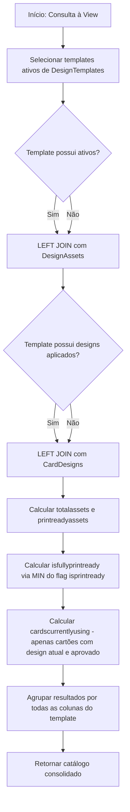

# design.vwCardDesignCatalog

## Visão Geral

View pertencente ao schema `design` da aplicação **NovoCard**, responsável por fornecer o catálogo público de designs de cartões utilizado pela interface de personalização. A view consolida templates ativos com métricas de composição de ativos e indicadores de popularidade, excluindo templates inativos ou descontinuados.

---

## Estrutura de Dados

### Fonte de Dados

| Tabela | Schema | Papel |
|---|---|---|
| `design.DesignTemplates` | `design` | Tabela principal contendo os templates de design |
| `design.DesignAssets` | `design` | Ativos gráficos vinculados a cada template |
| `design.CardDesigns` | `design` | Designs aplicados a cartões, com status de aprovação |

### Relacionamentos

| Origem | Destino | Tipo de Join | Chave |
|---|---|---|---|
| `DesignTemplates` | `DesignAssets` | LEFT JOIN | `templateid` |
| `DesignTemplates` | `CardDesigns` | LEFT JOIN | `templateid` |

### Filtros Aplicados

| Condição | Descrição |
|---|---|
| `dt.isactive = 1` | Apenas templates ativos são retornados |

---

## Colunas Retornadas

### Dados do Template

| Coluna | Descrição |
|---|---|
| `templateid` | Identificador único do template |
| `templatename` | Nome interno do template |
| `displayname` | Nome de exibição para o usuário final |
| `version` | Versão do template |
| `description` | Descrição textual do template |
| `category` | Categoria de classificação |
| `tags` | Array JSON com tags descritivas |
| `primarycolor` | Cor primária do design |
| `secondarycolor` | Cor secundária do design |
| `baseimageurl` | URL da imagem base do template |
| `thumbnailurl` | URL da miniatura para pré-visualização |
| `isdarktheme` | Indica se o template utiliza tema escuro |
| `isdefault` | Indica se é o template padrão |
| `compatibleproductclasses` | Array JSON com classes de produto compatíveis |
| `compatiblenetworks` | Array JSON com bandeiras de rede compatíveis |
| `downloadcount` | Contador de downloads do template |
| `createdat` | Data de criação do template |
| `updatedat` | Data da última atualização |

### Métricas de Composição de Ativos

| Coluna | Tipo | Descrição |
|---|---|---|
| `totalassets` | Contagem | Número total de ativos vinculados ao template |
| `printreadyassets` | Contagem | Quantidade de ativos prontos para impressão |
| `isfullyprintready` | BIT | `1` se **todos** os ativos do template estão prontos para impressão; `0` caso contrário |

### Métricas de Utilização

| Coluna | Tipo | Descrição |
|---|---|---|
| `cardscurrentlyusing` | Contagem distinta | Número de cartões distintos que utilizam o template com design atual (`iscurrent = 1`) e status de aprovação `APPROVED` |

---

## Fluxo de Processamento

---

## Insights

- A utilização de `LEFT JOIN` garante que templates sem ativos ou sem designs aplicados ainda apareçam no catálogo, retornando valores zerados nas métricas calculadas.
- O campo `isfullyprintready` utiliza a função `MIN` sobre o flag `isprintready` — se qualquer ativo não estiver pronto para impressão, o valor mínimo será `0`, sinalizando que o template não está completamente apto para produção gráfica.
- A métrica `cardscurrentlyusing` considera apenas cartões com design **vigente** (`iscurrent = 1`) e **aprovado** (`approvalstatus = 'APPROVED'`), oferecendo uma visão real de adoção do template em produção.
- Templates inativos ou descontinuados são completamente excluídos, garantindo que a interface de personalização exiba apenas opções válidas para seleção.
- O campo `downloadcount` vem diretamente da tabela de templates, sugerindo que essa métrica é mantida de forma incremental na origem, e não calculada pela view.
- A presença de campos JSON (`tags`, `compatibleproductclasses`, `compatiblenetworks`) indica que a aplicação consumidora realiza parsing desses dados no lado cliente para filtragem e exibição dinâmica.
