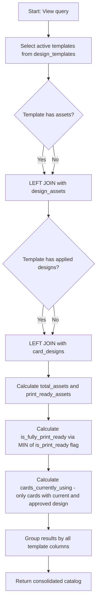

# design.vw_card_design_catalog

## Overview

View belonging to the `design` schema of the **NovoCard** application, responsible for providing the public design catalog used by the customization interface. The view consolidates active templates with asset composition metrics and popularity indicators, excluding inactive or discontinued templates.

---

## Data Structure

### Data Sources

| Table | Schema | Role |
|---|---|---|
| `design.design_templates` | `design` | Main table containing design templates |
| `design.design_assets` | `design` | Graphic assets linked to each template |
| `design.card_designs` | `design` | Designs applied to cards, with approval status |

### Relationships

| Source | Destination | Join Type | Key |
|---|---|---|---|
| `design_templates` | `design_assets` | LEFT JOIN | `template_id` |
| `design_templates` | `card_designs` | LEFT JOIN | `template_id` |

### Applied Filters

| Condition | Description |
|---|---|
| `dt.is_active = 1` | Only active templates are returned |

---

## Returned Columns

### Template Data

| Column | Description |
|---|---|
| `template_id` | Unique template identifier |
| `template_name` | Internal template name |
| `display_name` | Display name shown to the end user |
| `version` | Template version |
| `description` | Textual description of the template |
| `category` | Classification category |
| `tags` | JSON array with descriptive tags |
| `primary_color` | Primary design color |
| `secondary_color` | Secondary design color |
| `base_image_url` | URL of the template's base image |
| `thumbnail_url` | Thumbnail URL for preview |
| `is_dark_theme` | Indicates whether the template uses a dark theme |
| `is_default` | Indicates whether this is the default template |
| `compatible_product_classes` | JSON array with compatible product classes |
| `compatible_networks` | JSON array with compatible payment networks |
| `download_count` | Template download counter |
| `created_at` | Template creation date |
| `updated_at` | Last update date |

### Asset Composition Metrics

| Column | Type | Description |
|---|---|---|
| `total_assets` | Count | Total number of assets linked to the template |
| `print_ready_assets` | Count | Number of assets ready for printing |
| `is_fully_print_ready` | BIT | `1` if **all** template assets are print-ready; `0` otherwise |

### Usage Metrics

| Column | Type | Description |
|---|---|---|
| `cards_currently_using` | Distinct count | Number of distinct cards using the template with current design (`is_current = 1`) and `APPROVED` approval status |

---

## Processing Flow

---

## Insights

- The use of `LEFT JOIN` ensures templates without assets or without applied designs still appear in the catalog, returning zero values in the calculated metrics.
- The `is_fully_print_ready` field uses the `MIN` function over the `is_print_ready` flag — if any asset is not print-ready, the minimum value will be `0`, signaling that the template is not fully ready for graphic production.
- The `cards_currently_using` metric considers only cards with a **current** (`is_current = 1`) and **approved** (`approval_status = 'APPROVED'`) design, providing a real view of template adoption in production.
- Inactive or discontinued templates are completely excluded, ensuring the customization interface displays only valid options for selection.
- The `download_count` field comes directly from the templates table, suggesting this metric is maintained incrementally at the source rather than calculated by the view.
- The presence of JSON fields (`tags`, `compatible_product_classes`, `compatible_networks`) indicates that the consuming application performs client-side parsing of these values for dynamic filtering and display.
